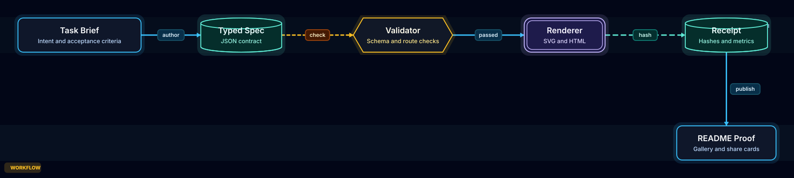

# visual-architecture

[](https://github.com/LeoStehlik/visual-architecture/actions/workflows/validate.yml)

**Deterministic, local-first architecture artifacts for agents.**

visual-architecture turns local repo evidence or typed JSON specs into SVG, self-contained HTML, share cards, receipts, and a generated Pages showcase. The v1.8 contract is stronger: agents can extract TypeScript monorepo structure, infer app/package/backend/frontend surfaces, attach confidence-scored evidence, lay it out deterministically, validate evidence quality, and publish a reviewable artifact bundle.

The wedge against Archify is local-first proof: architecture artifacts that look intentional, cite their sources, explain PR deltas, and remain reproducible from a repo scan or checked JSON.



## Visual Gallery

Open the generated artifact site: **https://leostehlik.github.io/visual-architecture/**

The gallery is the browsing surface: artifact rail, large diagram stage, story path, receipt quality, share cards, source evidence drilldown, and a public TypeScript-monorepo case study. The README stays as the product brief; the repo keeps the JSON specs, SVG/HTML artifacts, and receipts for audit.


## Public Case Study

The current conversion artifact is a sanitized TypeScript monorepo map: client app, server app, editor extension, shared packages, backend modules, realtime gateway, database layer, and proof bundle.

Open it in the gallery or inspect the checked files directly:

```bash
python3 scripts/render_architecture.py deliver examples/showcase-typescript-monorepo-case-study.json /tmp/typescript-monorepo-case-study.html --json
python3 scripts/render_architecture.py bundle examples/showcase-typescript-monorepo-case-study.json /tmp/typescript-monorepo-case-study --min-quality good
```

- Case-study notes: [`docs/public-typescript-monorepo-case-study.md`](docs/public-typescript-monorepo-case-study.md)
- Spec: [`examples/showcase-typescript-monorepo-case-study.json`](examples/showcase-typescript-monorepo-case-study.json)
- SVG: [`examples/showcase-typescript-monorepo-case-study.svg`](examples/showcase-typescript-monorepo-case-study.svg)
- Receipt: [`examples/showcase-typescript-monorepo-case-study.html.receipt.json`](examples/showcase-typescript-monorepo-case-study.html.receipt.json)

## Why It Exists

Agents are good at inventing diagrams and bad at proving what they just drew. visual-architecture gives them a narrow, deterministic path:

1. Author a compact JSON spec.
2. Validate supported modes, node kinds, edge kinds, endpoints, evidence fields, grid placement, and obvious route hazards.
3. Deliver SVG or HTML atomically.
4. Emit a JSON receipt with input/output SHA-256, byte counts, metrics, warnings, and validation result.

The output stays local and deterministic, but no longer uses one generic box-arrow treatment for every artifact. Architecture, workflow, sequence, data-flow, lifecycle, and PR delta modes now get distinct visual scaffolding.

## Install

### OpenClaw / ClawHub

```bash
openclaw skills install visual-architecture
```

### Manual

```bash
git clone https://github.com/LeoStehlik/visual-architecture.git ~/.openclaw/workspace/skills/visual-architecture
```

For Codex, Claude Code, OpenCode, or another agent harness, copy this repo or the `SKILL.md` plus `scripts/` and `examples/` into the harness skill directory.

## Quick Start

Validate a spec:

```bash
python3 scripts/render_architecture.py validate examples/service-map.json --json
```

Render a static SVG:

```bash
python3 scripts/render_architecture.py deliver examples/service-map.json examples/service-map.svg --json
```

Deliver a self-contained HTML artifact:

```bash
python3 scripts/render_architecture.py deliver examples/agent-runtime.json examples/agent-runtime.html --json
```

Compare base/head specs for a PR delta artifact:

```bash
python3 scripts/render_architecture.py compare examples/pr-delta-before.json examples/pr-delta-head.json examples/pr-delta-generated.html --spec examples/pr-delta-generated.json --json
```

Extract TypeScript-aware repo evidence, apply layout, generate a bundle, or build the gallery:

```bash
python3 scripts/render_architecture.py extract-repo . --output examples/visual-architecture-auto.json --title "Generated TypeScript-Aware Repo Map"
python3 scripts/render_architecture.py layout examples/visual-architecture-auto.json /tmp/laid-out.json --mode architecture
python3 scripts/render_architecture.py bundle examples/visual-architecture-auto.json /tmp/visual-architecture-bundle --min-quality good
python3 scripts/render_architecture.py gallery index.html
```

The legacy v0.2 command still works:

```bash
python3 scripts/render_architecture.py examples/service-map.json examples/service-map.svg
```

## Checked Artifacts

The checked examples cover service maps, agent workflows, repo evidence, PR deltas, sequence, data-flow, lifecycle, and the dark showcase theme. Browse them through the generated site instead of raw GitHub file views:

- Gallery: https://leostehlik.github.io/visual-architecture/
- Hero spec: [`examples/showcase-artifact-engine.json`](examples/showcase-artifact-engine.json)
- Hero receipt: [`examples/showcase-artifact-engine.html.receipt.json`](examples/showcase-artifact-engine.html.receipt.json)

Share-card SVGs are generated beside each example as `*.share-card.svg`.

Run the same local proof gate as CI:

```bash
make validate
```

Regenerate all examples:

```bash
make examples
```

## JSON Model

```json
{
  "mode": "architecture",
  "theme": "classic",
  "title": "Service Map",
  "summary": "One local request path with async work and model access.",
  "nodes": [
    {
      "id": "web",
      "label": "Web App",
      "subtitle": "User interface",
      "kind": "service",
      "x": 120,
      "y": 160
    },
    {
      "id": "api",
      "label": "API",
      "subtitle": "Business logic",
      "kind": "service",
      "x": 360,
      "y": 160
    }
  ],
  "edges": [
    {
      "from": "web",
      "to": "api",
      "kind": "primary-data",
      "label": "HTTP"
    }
  ]
}
```

Node kinds:

- `service` - rounded rectangle
- `llm` - double-border rounded rectangle
- `agent` - hexagon
- `memory` - cylinder

Edge kinds:

- `primary-data` - blue solid arrow
- `memory-write` - green dashed arrow
- `control` - slate dashed arrow

Supported modes:

- `architecture` - component maps, services, stores, boundaries
- `workflow` - agent/tool/process/runbook paths
- `sequence` - request/API/call lifecycles
- `dataflow` - pipelines, lineage, stores, sensitive boundaries
- `lifecycle` - states, retries, waits, terminal outcomes
- `pr-delta` - review artifacts for base/head architecture changes

Themes:

- `classic` - light documentation artifact, used by default
- `showcase` - dark README/release artifact for first-screen proof images

Evidence fields can be added to nodes or edges:

```json
{
  "source": "services/fraud/client.ts",
  "line": 42,
  "commit": "abc1234",
  "confidence": "medium",
  "note": "Fraud scoring client introduced by this PR."
}
```

Nodes with evidence render a compact `SRC n` badge. Receipts count evidence items and keep PR delta facts separate from ordinary artifact validation.

## Receipt Contract

`deliver` writes `<artifact>.receipt.json` by default. A receipt includes:

- tool/version
- artifact kind: `svg` or `html`
- input path, SHA-256, and byte count
- output path, SHA-256, and byte count
- validation status, errors, warnings, and metrics

Validation currently checks the shape of the spec, supported modes and semantic kinds, unknown endpoints, evidence field shape, duplicate/shared grid positions, route crossings through unrelated nodes, edge crossings, density, visual overlap, and long labels that are likely to crowd the diagram. Receipts include a quality score so ugly artifacts are visible as defects, not treated as successful output.

Stable diagnostic codes are documented in [`docs/diagnostics.md`](docs/diagnostics.md).

## Roadmap

Completed v1.0 ladder:

- v0.3: public foundation, examples, HTML wrapper, release hygiene
- v0.4: schemas, validate/deliver receipts, CI proof
- v0.5: workflow, sequence, data-flow, and lifecycle modes
- v0.6: source evidence fields, evidence validation, `SRC n` badges, evidence metrics
- v0.7: base/head PR delta compare command with review receipt
- v1.0: proof gallery, share-card artifacts, harness notes, GitHub release surface

Harness install/use notes are in [`docs/harnesses.md`](docs/harnesses.md), and short proof demos for OpenClaw, Codex, Claude Code, and OpenCode are in [`docs/harness-demos.md`](docs/harness-demos.md). ClawHub sync checks are in [`docs/clawhub-sync.md`](docs/clawhub-sync.md).

Next high-value work:

- deeper automatic layout per mode, especially sequence/data-flow/lifecycle
- stronger label clearance and route-quality diagnostics
- route, config, call graph, and cross-package dependency extraction beyond the current public case-study surface
- PNG export when a portable raster dependency is available

## Repository

```text
visual-architecture/
├── SKILL.md
├── examples/
│   ├── *.json
│   ├── *.svg
│   ├── *.html
│   ├── *.receipt.json
│   └── *.share-card.svg
├── schemas/
│   └── *.schema.json
├── docs/
│   └── gallery.html
├── scripts/
│   └── render_architecture.py
├── .github/workflows/
│   └── validate.yml
├── Makefile
└── README.md
```

## Status

v1.8.0 public case-study conversion: deterministic renderer, TypeScript-aware extraction, schemas, mode-aware validation, delivery receipts, HTML/SVG/share-card artifacts, source evidence badges, PR delta compare, gallery, and a sanitized TypeScript monorepo case study.

## License

MIT. See [LICENSE](LICENSE).
