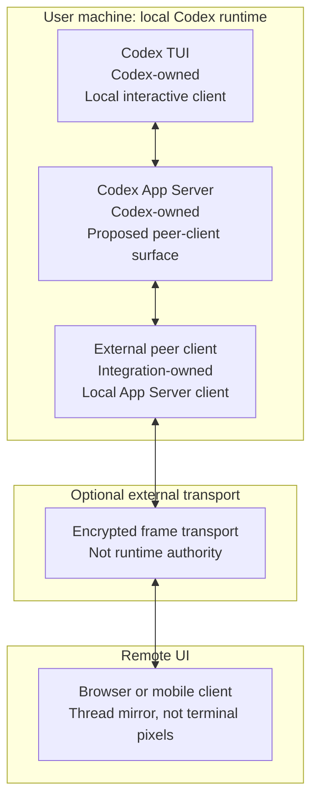

# OpenAI App Server Peer Client Issue Draft

## Title

```text
Question: Is Codex App Server the intended surface for live TUI peer clients?
```

## Body

````markdown
## Summary

We are building a remote rich client for a local Codex TUI session. The goal is not to run a second Codex agent and not to scrape terminal pixels. The goal is for a second local client to attach to the same live Codex thread as the TUI, hydrate history, receive streamed thread events, start or steer turns when appropriate, and surface approvals or Stop state through the same App Server protocol.

The public App Server docs describe `codex app-server` as the interface for rich clients that need conversation history, approvals, and streamed agent events. That sounds like the right layer, but we want to confirm the intended architecture before preparing a formal PR.

Docs reference:
https://developers.openai.com/codex/app-server

## Architecture



In our proof, Codex still runs locally. The external client is a peer client of App Server, not a second Codex runner. Any hosted transport outside the machine only carries encrypted client frames and is not authoritative over Codex runtime state.

## What we observed

With stock App Server, a separate client can initialize, resume a stored thread, hydrate persisted history, and start a turn. However, full co-presence was not observed in our tested build: an additional observer did not reliably receive a normal TUI-originated turn stream, and an App Server-started turn was not live-rendered back through the active TUI/browser path as one shared event bus.

That suggests the missing primitive may be multi-subscriber live thread events, not a product-specific remote-control feature.

## Codex-only patch shape

We have a narrow local branch based on `upstream/main` that only changes Codex-side event fanout:

- add an event fanout in `CodexThread`;
- let legacy callers keep using `next_event()`;
- let App Server listener tasks subscribe independently;
- add a websocket App Server test where two clients resume the same thread, one starts a turn, and both receive matching turn notifications.

Touched files:

```text
codex-rs/core/src/codex_thread.rs
codex-rs/app-server/src/request_processors/thread_lifecycle.rs
codex-rs/app-server/tests/suite/v2/connection_handling_websocket.rs
```

This branch does not include any hosted relay code, browser UI, mobile UI, install flow, or product-specific protocol.

## Question

Is App Server intended to support this kind of live peer-client co-presence with the Codex TUI?

If yes, is multi-subscriber live thread event fanout the right direction for an upstream PR, or is there a different App Server surface OpenAI wants external rich clients to use for attaching to the active TUI thread?
````
