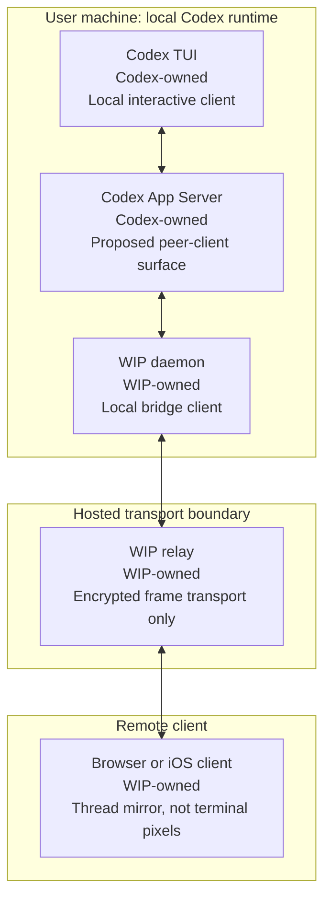

# OpenAI Upstream App Server Peer Client Packet

## Purpose

Prepare the OpenAI-facing Remote Control upstream artifact.

This is issue prep, not a product implementation pass. The narrow question is:

```text
Is Codex App Server the intended surface for external peer clients that need to attach to the live TUI thread?
```

OpenAI's App Server docs frame `codex app-server` as the interface for rich clients that need authentication, conversation history, approvals, and streamed agent events. The same docs distinguish that surface from the Codex SDK, which is the better fit for automation and CI.

Source: https://developers.openai.com/codex/app-server

Clean issue-ready draft:

```text
ai/product/plans-prds/codex-remote-control/2026-05-06--codex--openai-app-server-peer-client-issue-draft.md
```

## Architecture Diagram



### Diagram Notes

- Codex runs locally on the user's machine.
- The TUI and daemon should attach to the same live App Server thread.
- The daemon is a peer App Server client, not a second Codex runner.
- The WIP relay transports encrypted frames. It is not the authority over Codex runtime state.
- The browser or iOS client mirrors the Codex thread and turn stream. It does not scrape terminal pixels.
- The Codex-side surface is App Server peer access plus live event fanout.
- WIP relay, browser UI, iOS UI, passkeys, install flow, and product pairing are outside the proposed OpenAI surface.

## Current Codex-Only Branch

Repo:

```text
wipcomputer/openai-codex-private
```

Upstream remote:

```text
upstream -> https://github.com/openai/codex.git
```

Candidate branch:

```text
cc-mini/app-server-multi-listener
```

Base:

```text
upstream/main
```

Head commit:

```text
9c1f151193 Fan out Codex thread events to peers
```

Diff summary:

```text
codex-rs/core/src/codex_thread.rs                         | event fanout
codex-rs/app-server/src/request_processors/thread_lifecycle.rs | per-connection subscription
codex-rs/app-server/tests/suite/v2/connection_handling_websocket.rs | peer broadcast test
```

Patch shape:

- Adds a `ThreadEventFanout` inside `CodexThread`.
- Keeps one source consumer for the underlying Codex event receiver.
- Lets legacy `next_event()` callers lazily subscribe through the fanout.
- Lets each App Server listener subscribe independently with `subscribe_events()`.
- Changes App Server thread lifecycle listening so one connection does not consume the only thread event stream.
- Adds a websocket App Server test proving two initialized clients can resume the same stored thread, one client can start a turn, and both clients receive matching `turn/started` and `turn/completed` notifications.

This is the cleanest first upstream discussion artifact because it contains only generic Codex event fanout behavior. It includes no WIP relay, daemon, browser, iOS, install, auth, URL, or private planning files.

## Optional Codex Follow-Up

There are separate fork branches for current-thread MCP environment metadata:

```text
cc-mini/mcp-active-thread-env
cc-mini/mcp-initial-thread-env
```

Those branches inject current thread metadata such as `CODEX_THREAD_ID` and `CODEX_THREAD_NAME` for stdio MCP servers. That is useful for WIP's natural-language `start remote control` entrypoint, but it is separable from the first App Server peer-client question.

Recommendation:

- Keep the first OpenAI issue centered on App Server peer co-presence and event fanout.
- Mention current-thread MCP metadata only as a possible follow-up if maintainers ask about launch and discovery.
- Do not bundle MCP environment injection into the initial issue unless the maintainer direction is "yes, App Server peer clients are supported, send the complete integration patch."

## Validation Snapshot

Commands inspected on 2026-05-06:

```bash
git diff --name-status upstream/main...cc-mini/app-server-multi-listener
git diff --stat upstream/main...cc-mini/app-server-multi-listener
bash /Users/lesa/wipcomputerinc/repos/third-party-repos/openai-codex-private/scripts/check-upstream-pr-clean.sh upstream/main
cargo test -p codex-core thread_event_fanout
cargo test -p codex-app-server websocket_transport_broadcasts_turn_events_to_resumed_peer
```

Observed Codex-only file list:

```text
M codex-rs/app-server/src/request_processors/thread_lifecycle.rs
M codex-rs/app-server/tests/suite/v2/connection_handling_websocket.rs
M codex-rs/core/src/codex_thread.rs
```

Observed diffstat:

```text
3 files changed, 216 insertions(+), 4 deletions(-)
```

Private-file check:

```text
No ai/** files are present in the candidate branch diff.
No WIP relay, daemon, browser, iOS, install, or product code is present in the candidate branch diff.
Upstream hygiene script exited 0 from the candidate branch worktree.
Focused Codex tests passed: 2 core fanout tests and 1 App Server websocket peer broadcast test.
```

Recommended revalidation before sharing upstream:

```bash
cd /Users/lesa/wipcomputerinc/repos/third-party-repos/openai-codex-private/.worktrees/openai-codex-private--cc-mini-app-server-multi-listener
bash /Users/lesa/wipcomputerinc/repos/third-party-repos/openai-codex-private/scripts/check-upstream-pr-clean.sh upstream/main
cd codex-rs
cargo test -p codex-core thread_event_fanout
cargo test -p codex-app-server websocket_transport_broadcasts_turn_events_to_resumed_peer
just fmt
```

Note: the upstream hygiene script lives on the private fork's `main`; the candidate upstream branch intentionally does not need private WIP scripts in its own diff.

## OpenAI Issue Draft

Title:

```text
Question: Is Codex App Server the intended surface for live TUI peer clients?
```

Body:

````markdown
## Summary

We are building a remote rich client for a local Codex TUI session. The goal is not to run a second Codex agent and not to scrape terminal pixels. The goal is for a second local client to attach to the same live Codex thread as the TUI, hydrate history, receive streamed thread events, start or steer turns when appropriate, and surface approvals or Stop state through the same App Server protocol.

The public App Server docs describe `codex app-server` as the interface for rich clients that need conversation history, approvals, and streamed agent events. That sounds like the right layer, but we want to confirm the intended architecture before preparing a formal PR.

Docs reference:
https://developers.openai.com/codex/app-server

## Architecture

```text
Codex TUI
   |
   v
Codex App Server
   |
   v
External peer client
   |
   v
Remote browser or mobile UI
```

In our proof, Codex still runs locally. The external client is a peer client of App Server, not a second Codex runner. Any hosted transport outside the machine only carries encrypted client frames and is not authoritative over Codex runtime state.

## What we observed

With stock App Server, a separate client can initialize, resume a stored thread, hydrate persisted history, and start a turn. However, full co-presence was not observed in our tested build: an additional observer did not reliably receive a normal TUI-originated turn stream, and an App Server-started turn was not live-rendered back through the active TUI/browser path as one shared event bus.

That suggests the missing primitive may be multi-subscriber live thread events, not a product-specific remote-control feature.

## Codex-only patch shape

We have a narrow fork branch based on `upstream/main` that only changes Codex-side event fanout:

- add an event fanout in `CodexThread`;
- let legacy callers keep using `next_event()`;
- let App Server listener tasks subscribe independently;
- add a websocket App Server test where two clients resume the same thread, one starts a turn, and both receive matching turn notifications.

Touched files:

```text
codex-rs/core/src/codex_thread.rs
codex-rs/app-server/src/request_processors/thread_lifecycle.rs
codex-rs/app-server/tests/suite/v2/connection_handling_websocket.rs
```

This branch does not include any hosted relay code, browser UI, mobile UI, install flow, or product-specific protocol.

## Question

Is App Server intended to support this kind of live peer-client co-presence with the Codex TUI?

If yes, is multi-subscriber live thread event fanout the right direction for an upstream PR, or is there a different App Server surface OpenAI wants external rich clients to use for attaching to the active TUI thread?
````

## Upstream PR Boundary

Do not open an upstream PR yet.

Before opening one:

- Rebase the candidate branch on fresh `upstream/main`.
- Run the upstream hygiene check.
- Run the focused Rust tests.
- Confirm no `ai/**` files are in the upstream diff.
- Confirm no WIP relay, daemon, Kaleidoscope, browser, iOS, passkey, install, or product-security notes are in the upstream diff.
- Convert this issue draft into a public GitHub issue without private repo paths, private ticket names, dogfood transcripts, or internal review references.
