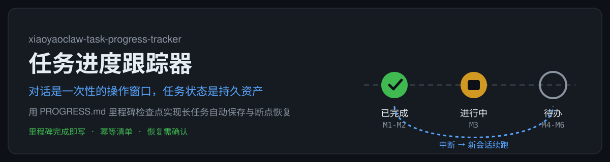
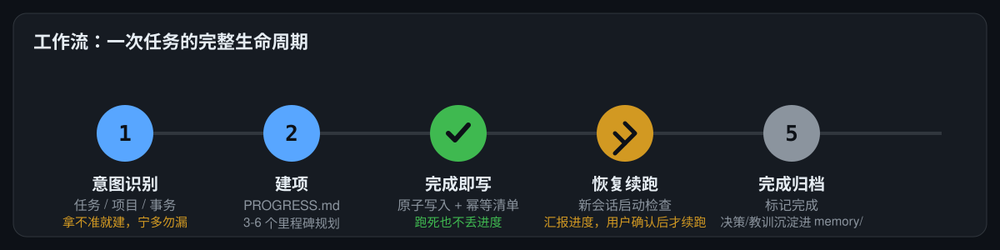

# OpenClaw Task Progress Tracker 📋

<p align="center">
  
</p>

> 将「对话流」与「任务状态」分离，用 PROGRESS.md 里程碑检查点实现长任务自动保存与断点恢复。
> Long-task auto-save & resume with PROGRESS.md milestone checkpoints — task state survives sessions.


## 为什么需要它

模型上下文有限——长任务可能被压缩、模型跑死、任务异常结束。没有任务状态跟踪，你的 agent 会：
- ❌ 长任务跑到一半被压缩/中断，进度静默丢失
- ❌ 换会话后不记得做到哪一步，只能从头再来
- ❌ 已完成步骤重复执行，副作用叠加

这个 skill 一次性解决：**完成即写 + 幂等清单 + 断点恢复**。

## 特性

- ✍️ **完成即写**：每完成一个里程碑立即更新 PROGRESS.md（原子写入 `.tmp` → rename），不等会话结束——跑死也不丢进度
- 🔁 **幂等清单**：已完成步骤逐条记录，恢复时从「下一步」开始，不重复执行已完成副作用
- 🙋 **恢复需用户确认**：新会话自动发现 + 汇报未完成任务，但不擅自续跑（反馈至上铁律）
- 🧭 **意图识别兜底**：任务 / 项目 / 普通事务，拿不准一律按任务建项（误建无害，漏建 = 任务静默丢失）
- 🗂️ **分层不混用**：PROGRESS.md = 任务状态层（机械事实，可重建）；memory/ + MEMORY.md = 记忆层（决策/教训），互不替代
- 🧩 **路径仲裁**：目录位置一律服从 WORKSPACE.md；无 WORKSPACE.md 时用默认约定（工作区根 `tasks/` `projects/`），目录缺失自动创建——无 workspace-initializer 也能独立使用

## 安装

```bash
# ClawHub（推荐）
clawhub install xiaoyaoclaw-task-progress-tracker

# 或从 GitHub 手动安装
git clone https://github.com/dtsola/xiaoyaoclaw-task-progress-tracker
# 把 SKILL.md 和 templates/ 放到你的 skills 目录
```

## 使用

1. 把 skill 放到 OpenClaw 的 skills 目录，并将 `templates/AGENTS-startup-check.md` 追加到 agent 的 `AGENTS.md`「Session Startup」章节
2. 在 openclaw.json 的 `agents.list[].skills` 中加入 `xiaoyaoclaw-task-progress-tracker`（用 `config.patch`，禁止 `config.apply` 全量替换）
3. 之后 agent 自动按 5 步流程工作：

| 步骤 | 动作 |
|------|------|
| ① 意图识别 | 任务 / 项目 / 普通事务，拿不准就按任务建项 |
| ② 建项 | 在 `tasks/<name>/` 或 `projects/<name>/` 创建 PROGRESS.md，规划 3-6 个里程碑 |
| ③ 完成即写 | 每里程碑完成立即更新（原子写入 + 幂等清单，可中途调整里程碑并注明原因） |
| ④ 恢复 | 新会话启动扫描 `tasks/` `projects/` 下进行中的 PROGRESS.md，汇报进度，用户确认后续跑 |
| ⑤ 归档 | 标记「已完成」+ 完成时间，决策/教训沉淀进 memory/，目录原地保留 |

## 🚀 快速上手（三步，5 分钟）

### Step 1：安装技能

把本项目放到 agent 的 skills 目录（或用 `clawhub install xiaoyaoclaw-task-progress-tracker`），追加启动检查段到 `AGENTS.md`。

### Step 2：一句话建任务

对你的 agent 说：

> 记录任务：调研 XX 并输出报告

agent 会自动在 `tasks/` 下创建 PROGRESS.md、规划里程碑，并按工作流执行：



### Step 3：跑死也不怕

任务中断 / 模型跑死 / 换了新会话——对 agent 说「恢复任务」，它会自动扫描发现未完成任务、汇报进度，你确认后从「下一步」继续。

> 💡 进度不依赖会话存活：PROGRESS.md 是持久资产，新会话启动即可续跑。

## 与其他方案的区别

| | 裸会话（无跟踪） | 简单 TODO 文件 | **xiaoyaoclaw-task-progress-tracker** |
|---|---|---|---|
| 断点恢复 | ❌ 从头再来 | 手动核对 | ✅ 自动发现 + 用户确认后续跑 |
| 幂等防重 | ❌ | ❌ | ✅ 已完成步骤逐条记录，不重复执行 |
| 写盘时机 | — | 想起来才写 | ✅ 完成即写（原子写入） |
| 状态/记忆分层 | ❌ | ❌ | ✅ PROGRESS.md 与 memory/ 各司其职 |
| 独立可用 | — | ✅ | ✅ 无 workspace-initializer 也能独立使用 |

**实战验证**：长任务（多轮会话、上下文压缩、模型跑死）下进度不再丢失——PROGRESS.md 原子写入 + 幂等清单，恢复时从「下一步」继续。

## 姊妹项目

**OpenClaw Workspace Initializer**（工作区初始化器）：标准目录结构 + WORKSPACE.md 规范 + 多 agent 配置安全，给每个 OpenClaw agent 一个「家」——本技能管任务的「账本」，它是工作区的「家」，配合使用效果最佳。

👉 <https://github.com/dtsola/xiaoyaoclaw-workspace-initializer>

## 目录结构

```
xiaoyaoclaw-task-progress-tracker/
├── SKILL.md                    # 技能本体（意图识别/建项/更新/恢复/归档）
├── templates/
│   ├── PROGRESS.md             # 进度文件模板（目标/里程碑/幂等清单/下一步/阻塞点）
│   └── AGENTS-startup-check.md # AGENTS.md 启动检查段（可追加模板）
├── assets/readme/              # README 示意图（hero / workflow / 交流群二维码）
├── README.md
└── LICENSE
```

## License

MIT — 随便用，署名可选。

---

## 🛠️ 需要定制？

**Agent & Skills 定制，价格 ¥800 起。**

- 微信：`dtsola`（添加好友时备注：**openclaw定制**）
- 服务范围：OpenClaw 多 agent 部署 / 工作区规范化 / 自定义 Skill 开发 / agent 记忆系统搭建 / 任务进度体系搭建

## 小遥Claw

**小遥Claw，把 AI 助手装进自己的电脑。**

- 🚀 宣传页：<https://www.yuque.com/dtsola/igp1aa/adcicbai2zlem0bz>
- 📖 介绍页：<https://github.com/dtsola/xiaoyaoclaw-introduction>

## 关于作者

- 🌐 博客：<https://www.dtsola.com>
- 📺 B站：<https://space.bilibili.com/736015>
- 💻 GitHub：<https://github.com/dtsola>
- 📕 小红书：<https://www.xiaohongshu.com/user/profile/5b4c0597e8ac2b06aa13346d>

## 💬 加入交流群

小遥全系产品用户交流群——产品反馈 · 使用交流 · 功能建议：

<p align="center">
  
</p>

<p align="center">扫码加群，或添加微信 <code>dtsola</code>（备注：<b>加群</b>）</p>
