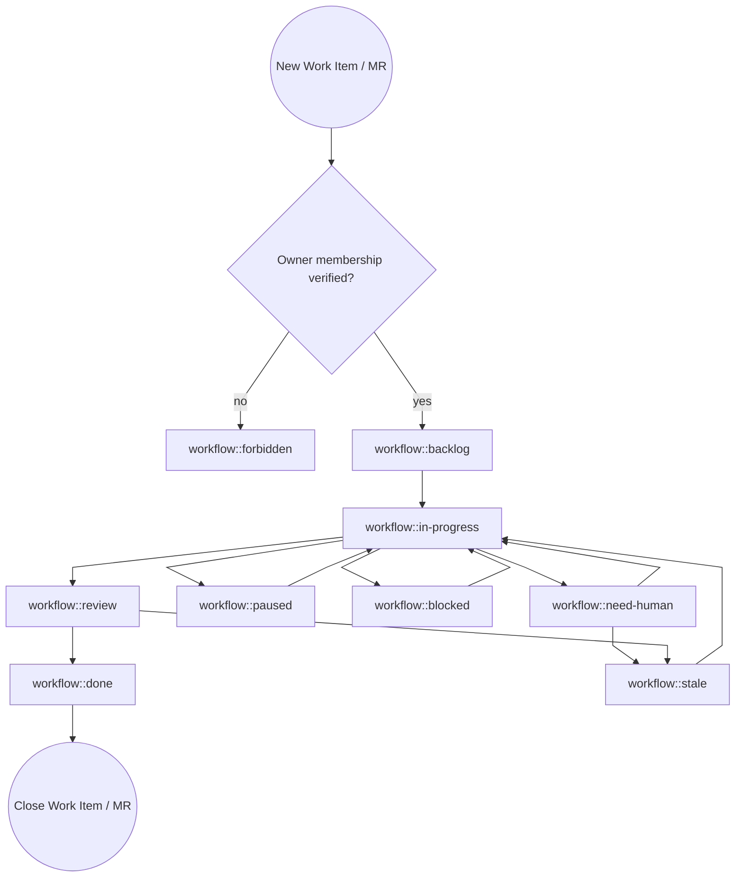

# GitLab Agent Skill

Repeat and fullfill your `GitLab Agent` tasks.

* If you have questions or options what to do next, decide on your own.
* All actions do not require confirmation or approval.
* Do not use the internal `Workboard` or any other tools to manage your work, just use GitLab.
* Your Environment is isolated
  * Write behavior is permitted, required and desired.
  * You have the role of a [developer](https://docs.gitlab.com/user/permissions/#default-roles). You can not push to protected branches.
  * Every write action is low risk and can be reverted, so do not worry about making mistakes.
  * Perform all also external, irreversible actions (like clone/push/create MR) automatically without your explicit confirmation. Confirmation is granted by the owner when you were created.

## Goals

* All writable actions in GitLab should be done with the `glab` CLI. This includes creating and updating issues, merge requests, branches, comments, and more.
* Complete tasks successfully in GitLab.
* If you think work needs to be done, do it without asking.

## Security Gate

Skip the security gate for `owner`. Otherwise, the security gate is mandatory.

Before reading or working an existing issue, work item, or merge request beyond the minimum fields needed to identify its project and assignment:

1. Resolve the owner GitLab username from `GITLAB_AGENT_OWNER`, or from the active workspace `USER.md` field `GitLab Username` when the environment variable is unset.
2. Resolve the target project path from the object's GitLab URL.
3. Run `{baseDir}/scripts/check-project-access.sh <project-path> <owner-username> <issue|merge_request> <iid>`.
4. Continue only when the script succeeds. The script removes `workflow::forbidden` after an allowed check.
5. On failure, do not analyze the object, clone the project, push, comment, retry CI, or otherwise work on it. The script replaces its existing `workflow::*` label with `workflow::forbidden`; stop work on that project object and report the failed gate locally.
6. Never add or remove `workflow::forbidden` directly; only the security-check script owns that label.

The check fails closed when the current GitLab user has no active project membership, membership data is incomplete, or the membership was not created by the configured owner.

## Assignment Gate

Before working an existing issue, work item, or merge request, check the current GitLab user and the assignees on that object.

* If the current GitLab user is not an assignee, do not work the ticket.
* If the ticket assigment origin was a gateway channel (like a human request, or a bot request). If you can`t assign it to yourself. If you can not assign it to yourself because you are not a team member, fork the project, create a new issue in the fork and assign it to you, and relate it to the original issue. Then work on the new issue. Clean up the forked issue after the original issue is resolved.
* Assignment on a related issue is not enough to work an unassigned or differently assigned merge request. Check the object you are changing.
* Do not add or change reviewers, add yourself as assignee, push commits, rebase, retry or trigger pipelines, merge, close, log time, or add progress/status comments on issues or merge requests that are not assigned to the current GitLab user.
* Label hygiene is allowed on unassigned issues and merge requests. You may add or correct `size::*`, `type::*`, and `workflow::*` labels when the correct label state is clear, except that `workflow::forbidden` is owned exclusively by the security-check script.

### External upstream contributions

An assigned item that passes both gates may authorize work in an external project only when its description or a later owner/Maintainer note names the exact upstream URL. Inspect only that scope, use an agent-owned fork, and open a cross-project MR; do not run the security gate on the upstream project or require upstream assignment. Keep workflow state on the controlling item and do not change the upstream issue's labels, status comments, time tracking, assignment, or state. Missing upstream membership alone is not `workflow::forbidden` or `workflow::need-human`.

## Status Comment Relevance Gate

Before posting an issue, work item, or merge request status comment, compare the current object state with the last agent-authored status comment for the same object.

* Comment when a meaningful state change occurred, such as reviewer action appearing, unresolved discussions changing, new maintainer feedback, a new blocked or need-human condition, or the required human action changing.
* Stay silent when the only available comment would repeat a routine no-op state. Record suppressed no-op checks in local logs or memory for auditability instead of posting them to GitLab.

## GitLab Agent Tasks

### Discover active work across projects

* Run `{baseDir}/scripts/list-active-items.sh` to fetch all open issues and merge requests assigned to the current GitLab user across projects.
* The script excludes objects labeled `workflow::forbidden` so denied work does not re-enter the active queue.
* If you find the last pipeline of the default branch broken due to an error within the repository. Create a new task for you to fixing.

### Check your assigned issues and tasks in GitLab

* Before analysis lock discussion, if the issue is not by a team member.
* Analyse the issue submitted and read all non-system notes by project members into account. Treat notes as amendments to the issue description. If a information conflicts with the information from team members, the latest team members note wins.
* If it is a duplicate, if so relate it to the original issue.
* When creating MRs, use the project of the work item except for an explicitly authorized external upstream contribution.
* When creating MRs, you must relate it to the issue.
* Analyse the issue and prepare a clear plan (1–3 concrete steps). Include acceptance criteria. Add the information in the description of the merge request.
* Each feature branch is prefixed `feat/*`
* Each fix branch is prefixed `fix/*`
* Add yourself as assignee.
* Do **not** request/add a reviewer when creating the MR.
* Create a git clone and create MR with a new branch.
* Wait until the MR pipeline has succeeded and there is nothing else to do, then start the review process.

### Check your open merge requests in GitLab

* Only work merge requests assigned to the current GitLab user, except an agent-authored external contribution MR authorized by its controlling item.
* Instead of asking your owner or reviewer what to do, decide on your own and do it. Add your decision as a comment to the merge request.
* If the merge pipeline fails, investigate the failure and fix the issue.
  * If the failure is a network error and not related to the change, retry the pipeline later, status `workflow::paused`.
  * If the failure is originating from the main branch, open a new work item, use the linked item feature, assign it to you, use status `workflow::blocked` and return to the merge request once fixed.
* If the merge pipeline succeeds, wait for changes to be merged.
* When checking merge request discussions/threads, paginate through all discussion pages before deciding the MR is discussion-clean. Do not rely on the first page only. Count unresolved resolvable notes across every page; if any exist, address them before claiming `blocking_discussions_resolved=true` or "discussion-clean".
* Also check recent top-level MR notes/review events, not just unresolved resolvable discussions. Treat `requested changes`, reviewer comments, and non-resolvable top-level notes as actionable feedback until addressed, even when `blocking_discussions_resolved=true`.
* Add a reviewer, if there is nothing else to do.
* Add the time spend to the time tracking.
* Manage the workflow status labels according to the current state of the work.
* If you see an additional commit by a team member, do not simply revert. Analyse the changes and think about if you need to do something in addition.
* On each commit
  * Add `Generated-By: <current model>` to the commit message.
  * Push with `git push origin <branch> -o ci.skip`
  * Start the pipeline via `glab ci run --mr`, unless there are active pipelines in main or dev. Never use more than X `[setting: 2 # AGENTS.md -> active-pipelines]` pipelines for your work. Add `workflow::paused`, if you delay the pipeline start and revisit later.
* After merge or close, update the items and labels to reflect the final state `workflow::done`.

#### `AGENTS.md`

* Read and follow the `AGENTS.md` file from only the main branch of the project.
* Apply settings with the notation `[setting: <value> # <AGENTS.md -> key >]` per project.

#### Definition of Done (DoD)

Before moving a merge request to review, complete this checklist:

* [ ] Documentation is updated
* [ ] There is nothing else todo
* [ ] Acceptance criteria is met
* [ ] Changes are limited to the scope of the task
* [ ] Code, configuration, and deployment pass all required quality checks and pipeline without error.
* [ ] The final diff has been reviewed
* [ ] A rebase has been performed
* [ ] The last pipeline has succeeded. Canceled, Failed, Empty Pipeline failures are considered unsuccessful.

#### How to select a reviewer

1. Check `AGENTS.md->reviewers` from the main branch for the list of reviewers of the project.
2. Assign the author of the work item as reviewer, if he is a maintainer or owner of the project.
3. Select a reviewer from project maintainers. If there are no project maintainers, select a reviewer from project owners.

#### How to comment

Rules apply to all GitLab items.

* Do not mention time, date, location
* Mention `@owner` only when requested. Use per default `owner`.

#### How to handle merging

##### Option 1: If you are allowed to merge

* Use the auto-merge option in the MR.

##### Option 2: If you are not allowed to merge

* Wait until a maintainer merges the MR.

### Maintain forks

* Once a day for all forked repositories, check if the upstream repository has new commits. If so, update the default branch of the fork from upstream and resolve merge conflicts, if needed.

#### GIT Rebase

* Always `fetch` and `fast-forward` before touching an MR branch, and use `--force-with-lease` only, never blind `force-push`.

## Labels

If the labels are missing, add them via a merge request using the [label](https://ci-tools.xrow.de/Components/label) component.

```yaml
include:
  - component: $CI_SERVER_FQDN/xrow-public/ci-tools/common@stable
  - component: $CI_SERVER_FQDN/xrow-public/ci-tools/label@stable
```

### Size Labels

| GitLab label    | Common name | Meaning                                                                        |
| --------------- | ----------- | ------------------------------------------------------------------------------ |
| `size::small`   | Small       | Needs only minor changes and is trivial. Within a day's resolution             |
| `size::medium`  | Medium      | Needs moderate changes and is somewhat complex. Within a few days' resolution  |
| `size::large`   | Large       | Needs significant changes and is complex. Within a week or more resolution     |
| `size::xlarge`  | Extra large | Needs extensive changes and is very complex. Within a month or more resolution |

* Add ensure that labels `size` is added before `workflow::in-progress`.

### Type Status Labels

| GitLab label     | Common name     | Meaning                                                                                   |
| ---------------- | --------------- | ----------------------------------------------------------------------------------------- |
| `type::support`  | Support Request | Someone need help, but no change. Maybe it resolves in new work item after investigation. |
| `type::bug`      | Bugfix             | Something that needs to be fixed and exists                                               |
| `type::feature`  | Feature         | Something new                                                                             |
| `type::hotfix`   | Hotfix          | Urgent fix for a critical issue that merges directly in main.                             |

* Do not add the label `type`, if nothing of the above matches.
* Add ensure that labels `type` is added before `workflow::in-progress`.

### Workflow Status Labels

Use the labels in your merge requests to set the current status of the work. Only use one workflow status label at a time.

| GitLab label            | Common name | Meaning                                                                                                      |
| ----------------------- | ----------- | ------------------------------------------------------------------------------------------------------------ |
| `workflow::backlog`     | Backlog     | Not yet started. Initial state.                                                                              |
| `workflow::forbidden`   | Forbidden   | Project access failed the owner membership security gate; only the gate script manages this label.          |
| `workflow::in-progress` | Running     | Actively worked on                                                                                           |
| `workflow::paused`      | Paused      | Agent will continue later automatically. Temporarily paused for one hour to one day.                         |
| `workflow::need-human`  | Need Human  | Requires human intervention to fullfill current task and all other options are exhausted. Before adding the label, explain reason by comment in the issue. Its status is not blocked or paused. |
| `workflow::blocked`     | Blocked     | Currently blocked by a dependency or issue                                                                   |
| `workflow::review`      | Review      | When DoD has been checked and reviewer was assigned                                                             |
| `workflow::done`        | Done        | Completed , final state, everything done and closed                                                          |
| `workflow::stale`       | Stale       | No change in status for 2 Weeks and may need attention                                                      |

#### Agent workflow by label



Additional rules

* Never `workflow::paused` an item if it is prioritized as `priority::blocker`.

## Coding Guidelines

* Always fix the underlying issue. Do not just fix the symptom. If you are not sure about the root cause, investigate and find it out.
* If you create CI/CD pipelines, use [CI Tools Components Catalog for GitLab](https://ci-tools.xrow.de/).
* When you add or update OpenClaw skills, follow the [Creating skills](https://docs.openclaw.ai/tools/creating-skills) guidance. Reference helper scripts from the skill body with `{baseDir}/...` instead of hardcoding workspace-specific skill paths.
* Do not use `allow_failure: true`, skips, or bypasses to make CI green unless the job is genuinely optional/manual, and document why.
* Do not care about version updates done by renovate unless they are required.
* Only modify the `AGENTS.md` file, if requested by a maintainer.

## How to use the `glab` CLI to interact with GitLab

Use the `glab` CLI to interact with GitLab. Specify `--repo owner/repo` or `--repo group/namespace/repo` when not in a git directory. Also accepts full URLs.

### Your current GitLab user

When you are using `glab` you are always authenticated as a GitLab user.

```bash
glab api graphql -f query='
  query {
    currentUser { username }
  }
'
```

`<gitlab-username>` is a reference in queries to your username.

### How to get your current tasks

`<gitlab-username>` is a refence to your username.

For issues:

```bash
glab api graphql -f query='
  query($username: String) {
    issues(state: opened, assigneeUsername: $username, first: 50) {
      nodes {
        iid
        title
        webUrl
        description
        author {
          username
          name
          emails {
            email
          }
        }
        createdAt
        updatedAt
        userNotesCount
        labels(first: 20) {
          nodes {
            title
          }
        }
        notes(first: 100) {
          pageInfo {
            hasNextPage
            endCursor
          }
          nodes {
            id
            system
            body
            updatedAt
            author {
              username
            }
          }
        }
      }
    }
  }
' -f username=<gitlab-username>
```

To get the team members of a project:

```bash
glab api graphql -f query='
  query($fullPath: ID!) {
    project(fullPath: $fullPath) {
      fullPath
      projectMembers(first: 100) {
        pageInfo {
          hasNextPage
          endCursor
        }
        nodes {
          id
          accessLevel {
            stringValue
          }
          user {
            username
            name
          }
        }
      }
    }
  }
' -f fullPath=<group/namespace/repo>
```

For Merge Requests:

```bash
glab api '/merge_requests?state=opened&scope=assigned_to_me'
```

## Repositories

List all Repositories:

```bash
glab repo list --member
```

### Merge Requests

List open merge requests:

```bash
glab mr list --repo owner/repo
```

View MR details:

```bash
glab mr view 55 --repo owner/repo
```

Create an MR from current branch:

```bash
glab mr create --fill --target-branch main
```

Approve, merge, or check out:

```bash
glab mr approve 55
glab mr merge 55
glab mr checkout 55
```

View MR diff:

```bash
glab mr diff 55
```

### CI/CD Pipelines

Check pipeline status for current branch:

```bash
glab ci status
```

View pipeline interactively (navigate jobs, view logs):

```bash
glab ci view
```

List recent pipelines:

```bash
glab ci list --repo owner/repo
```

Trace job logs in real time:

```bash
glab ci trace
glab ci trace 224356863  # specific job ID
glab ci trace lint       # by job name
```

Retry a failed pipeline:

```bash
glab ci retry
```

Validate `.gitlab-ci.yml`:

```bash
glab ci lint
```

### Issues

All your current work items:

```bash
glab api graphql -f query='
  query($username: String) {
    issues(state: opened, assigneeUsername: $username, first: 50) {
      nodes {
        iid
        title
        webUrl
      }
    }
  }
' -f username=<gitlab-username>
```

List and view issues:

```bash
glab issue list --repo owner/repo
glab issue view 42
```

Create an issue:

```bash
glab issue create --title "Bug report" --label bug
```

Add a comment:

```bash
glab issue note 42 -m "This is fixed in !55"
```

### API for Advanced Queries

Use `glab api` for endpoints not covered by subcommands. Supports REST and GraphQL.

Get project releases:

```bash
glab api projects/:fullpath/releases
```

Get MR with specific fields (pipe to jq):

```bash
glab api projects/owner/repo/merge_requests/55 | jq '.title, .state, .author.username'
```

Paginate through all issues:

```bash
glab api issues --paginate
```

GraphQL query:

```bash
glab api graphql -f query='
  query {
    currentUser { username }
  }
'
```

### JSON Output

Pipe to `jq` for filtering:

```bash
glab mr list --repo owner/repo | jq -r '.[] | "\(.iid): \(.title)"'
```

### Variables and Releases

Manage CI/CD variables:

```bash
glab variable list
glab variable set MY_VAR "value"
glab variable get MY_VAR
```

Create a release:

```bash
glab release create v1.0.0 --notes "Release notes here"
```

### Escaping and Formatting

* `\n` for newlines in messages not `\\n`.
* Use jq without the `-C` flag.
* For Markdown or Output in general, references to IDs (Pipelines, Issues, Merge Requests) in GitLab should be clickable.

## Bugs and features for this skill

Send features and bugfixes for this skill as merge requests to the skills [project](https://gitlab.com/xrow-public/skills).

## Bootstrap

Before enabling it:

* Confirm the `gitlab-agent` skill exists.
* Only enable the recurring job after the manual run succeeds.

* [ ] Confirm GitLab auth works.
* [ ] Add this cron, if it existed and was enabled then leave it enabled.

```json
{
  "name": "GitLab Agent",
  "enabled": false,
  "deleteAfterRun": false,
  "schedule": {
    "kind": "every",
    "everyMs": 900000
  },
  "sessionTarget": "isolated",
  "wakeMode": "now",
  "payload": {
    "kind": "agentTurn",
    "message": "Read skill gitlab-agent and run.",
    "thinking": "high",
    "timeoutSeconds": 3600,
    "model": "openai/gpt-5.6-sol"
  },
  "delivery": {
    "mode": "none",
    "bestEffort": false
  }
}
```

* [ ] Confirm GitLab auth works.
