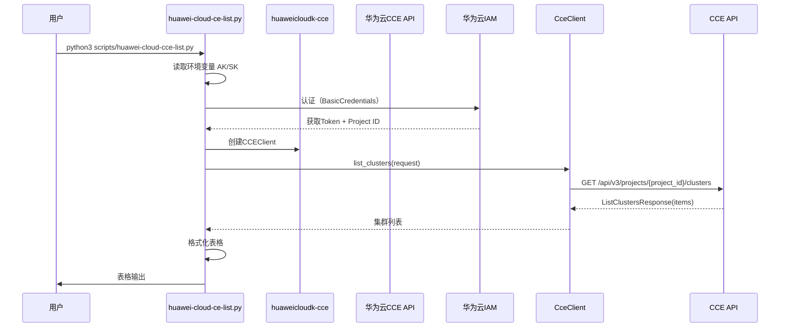

# 数据流图

```mermaid
sequenceDiagram
    participant User as 用户
    participant Script as huawei-cloud-ce-list.py
    participant SDK as huaweicloudk-cce
    participant CCEAP as 华为云CCE API
    participant IAM as 华为云IAM

    User->>Script: python3 scripts/huawei-cloud-cce-list.py
    Script->>Script: 读取环境变量 AK/SK
    Script->>IAM: 认证（BasicCredentials）
    IAM-->>Script: 获取Token + Project ID
    Script->>SDK: 创建CCEClient
    Script->>CceClient: list_clusters(request)
    CceClient->>CCE API: GET /api/v3/projects/{project_id}/clusters
    CCE API-->>CceClient: ListClustersResponse(items)
    CceClient-->>Script: 集群列表
    Script->>Script: 格式化表格
    Script->>User: 表格输出
```