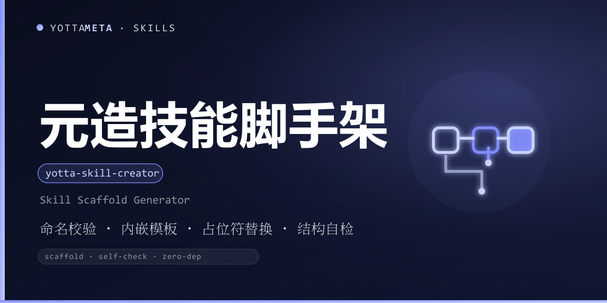

<p align="center"><b>Language</b>: <a href="./README.md">English</a> · 中文</p>

<p align="center">
  
</p>

<h1 align="center">yotta-skill-creator · 元造 (YuanZao)</h1>

<p align="center">YottaMeta 的<b>端到端造技能脚手架</b>：输入 <code>yotta-&lt;名称&gt;</code> + 中文名 + 描述，
从内嵌模板一键生成符合元阁发布规范的技能目录，生成后立即做结构自检，通过才输出「脚手架合格」。
<b>零外部依赖（Python 3.8+ 标准库）</b>；Windows + Linux + macOS 通用。</p>
<p align="center">触发场景：要新建一个 yotta- 技能、从零搭技能脚手架、想把发布规范里的坑固化成可复用模板时；
或说 元造 / 造技能 / 脚手架 / scaffold / 新建技能 等。</p>

<p align="center">
  <a href="LICENSE"></a>
  <a href="https://agentskills.io/"></a>
  <a href="https://www.npmjs.com/package/@yottameta/yotta-skill-creator"></a>
  <a href="https://github.com/YottaMeta/yotta-skill-creator"></a>
  <a href="https://github.com/YottaMeta/yotta-skill-creator/commits/main"></a>
  <a href="https://github.com/YottaMeta/yotta-skill-creator"></a>
</p>

## 这是什么

给智能体新建一个技能，往往要把发布规范里的坑重新踩一遍：命名规则、中英 README 四方式安装、版本对齐、
npm 打包、安装器。元造把「脚手架 + 结构自检」这一步固化成一条确定性命令——生成的脚手架天然符合元阁
发布规范，正文与逻辑是唯一剩下要写的东西。

## 工作方式

```bash
# 完整发布版脚手架（默认）
python3 scripts/yotta_skill_creator.py create yotta-my-tool \
    --zh 元工 --desc "做什么 + 何时触发 + 边界" --summary "一句话简介"

# 自用模式：只生成技能本体，不生成任何发布件
python3 scripts/yotta_skill_creator.py create yotta-private \
    --zh 元私 --desc "自用技能描述" --self-use

# 同时生成 CLI 骨架 + 测试；跳过 banner / install.sh
python3 scripts/yotta_skill_creator.py create yotta-tool2 \
    --zh 元工 --desc "..." --with-cli --no-banner --skip-installer
```

流程：命名校验 → 内嵌模板 → 占位符替换 → 结构自检；只有自检通过才返回退出码 0。

## 生成内容

**完整模式（默认）**：SKILL.md（四要素 frontmatter）/ README.md + README.zh-CN.md（四方式安装）/
package.json / CHANGELOG.md / LICENSE(MIT) / NOTICE / install.sh + bin/install.js /
.gitignore / .npmignore / .github/workflows/publish.yml / references/ / assets/。

**自用模式（--self-use）**：只生成技能本体 —— SKILL.md / references/（加 --with-cli 时含 scripts/），
不生成任何发布件。

## 选项

| 选项 | 作用 |
|---|---|
| `--zh 元X` | 中文名（必需，元X 规范） |
| `--desc "..."` | SKILL.md 描述：做什么 + 何时触发 + 边界（必需） |
| `--summary "..."` | 一句话简介（README 用；缺省 = desc） |
| `--out <目录>` | 输出父目录（缺省 = 当前目录，生成 `<out>/<name>/`） |
| `--with-cli` | 同时生成 CLI 骨架 + 测试（scripts/） |
| `--no-banner` | 跳过 assets/ 素材目录 |
| `--skip-installer` | 不生成 install.sh / bin/install.js（并从 package.json 去掉 bin） |
| `--self-use` | 自用模式：只生成技能本体，不生成发布件 |

## 命名校验（不通过即拒绝）

| 规则 | 要求 | 反例 |
|---|---|---|
| 前缀 | 必须以 `yotta-` 开头 | `my-tool` |
| 字符 | 小写字母 / 数字 / 连字符，不以连字符收尾 | `yotta-Bad` / `yotta-` |
| 长度 | ≤ 64 字符 | 超长名 |
| 中文名 | `元X`：以「元」开头，2-8 字符 | `工具`（缺「元」） |
| 目标 | 输出目录不存在（不覆盖） | 已存在的同名目录 |

## 结构自检（生成后自动执行）

任何一项不通过返回退出码 2：必需文件齐全（按模式）/ frontmatter 的 name 与目录名一致 /
package.json · SKILL.md · CHANGELOG 顶部版本一致 / README 中英各含四方式安装 /
无残留占位符 / Markdown 代码围栏配对。

## 退出码

| 退出码 | 含义 |
|---|---|
| 0 | 成功，脚手架合格 |
| 2 | 参数 / 命名 / 自检不通过 |
| 4 | 致命异常 |
| 130 | Ctrl+C 中断 |

## 行为锚点

1. **只生成、不覆盖**：目标目录已存在即拒绝，不覆盖任何文件。
2. **模板内嵌**：模板随发布包分发（`template/`），不依赖仓库 `tools/`。
3. **生成即自检**：`create` 结束前自动跑结构自检，通过才算完成。
4. **自用模式默认不碰发布件**：`--self-use` 明确「造技能 ≠ 发布」。

## 与工坊 / 工具链分工

| 技能 | 职责 |
|---|---|
| 元造 yotta-skill-creator（本技能） | **造**：生成合规脚手架 + 结构自检 |
| 元守 yotta-publish-guard | **守**：发布前 check / pack / versions / names / publish |

推荐链路：**元造 create（脚手架）→ 人工开发正文 / 脚本 / 测试 → 元守 check → pack → versions → names → publish**。

参考资料：`references/tutorial.md`（中文教程）、`references/cli-reference.md`（CLI 完整参考）、
`references/scaffold-structure.md`（生成目录结构）。

## 安装

以下四种方式任选，顺序即推荐优先级；技能文件一律从 **npm** 获取（GitHub 无代理较慢，npm 支持镜像）。

### 方式一：npm 一行装（推荐）

```text
# 可选国内加速：npm config set registry https://registry.npmmirror.com
npx -y @yottameta/yotta-skill-creator --agent <智能体名称>      # 装到指定智能体默认用户级技能目录
npx -y @yottameta/yotta-skill-creator --dir <智能体的技能目录>  # 指到技能目录本身（如 ~/.codex/skills）
```

- `--agent <name>` 自动装到该智能体默认用户级目录；`--list` 可查看各智能体默认目录。
- `--dir <路径>` 装到指定的技能目录；未收录的智能体用 `--dir` 指到它的技能目录。
- npmmirror 未同步新包（404）：加 `--registry=https://registry.npmjs.org/`（国内需代理），或稍等镜像缓存。

### 方式二：git clone（开发者 / 有 git 环境）

```text
git clone https://github.com/YottaMeta/yotta-skill-creator.git <智能体的技能目录>/yotta-skill-creator
```

### 方式三：GitHub 下载压缩包（手动 / 无 git 环境）

在 GitHub 仓库 `YottaMeta/yotta-skill-creator` 点 **Code → Download ZIP**，解压后把
`yotta-skill-creator` 文件夹放进智能体技能目录。

### 方式四：install.sh（多智能体一键脚本）

```text
bash install.sh --agent <name>   # 装到指定智能体默认用户级目录
bash install.sh --dir <path>     # 装到指定目录
bash install.sh --list           # 列出智能体 -> 默认目录
```

> 方式一走 npm 源（npmmirror / npmjs），不依赖 GitHub；方式二 / 三走 GitHub，国内无代理可能失败。

## 开发与校验

技能包自带测试脚本（随发布包一起分发）：

```bash
# 在技能目录内跑全量用例（20 个）
python scripts/test_yotta_skill_creator.py
```

## 许可证

MIT © YottaMeta —— 见 [LICENSE](./LICENSE)。
