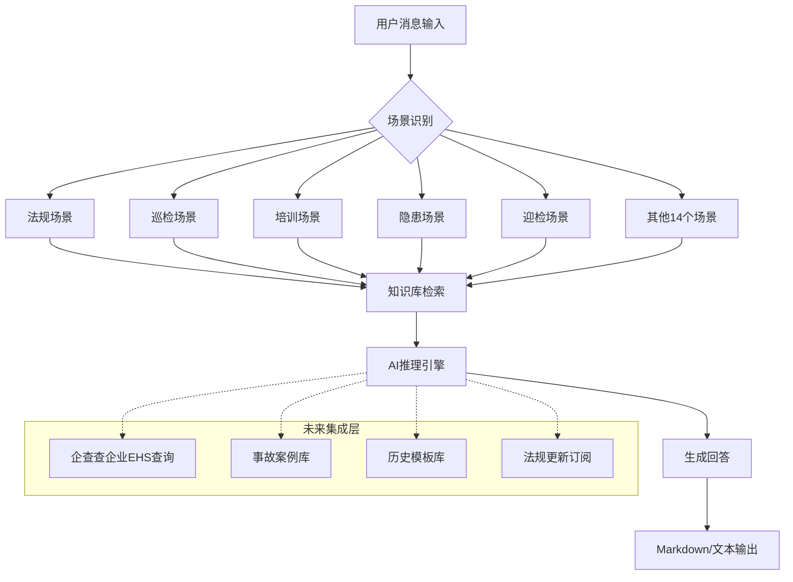

# EHS助理专员伙伴（OpenClaw Skill）— 项目规划书

> **项目代号：** 臻臻aiEHS
> **版本：** v1.0
> **编制日期：** 2026年7月16日
> **编制人：** EHS专业从业者

---

## 目录

1. [项目背景与立项依据](#1-项目背景与立项依据)
2. [项目目标](#2-项目目标)
3. [目标用户与画像](#3-目标用户与画像)
4. [核心功能架构](#4-核心功能架构)
5. [技术架构与设计](#5-技术架构与设计)
6. [已有资产盘点](#6-已有资产盘点)
7. [实施路线图](#7-实施路线图)
8. [交付物清单](#8-交付物清单)
9. [质量验收标准](#9-质量验收标准)
10. [风险评估与应对](#10-风险评估与应对)
11. [运营与迭代计划](#11-运营与迭代计划)
12. [附录](#12-附录)

---

## 1. 项目背景与立项依据

### 1.1 行业痛点

| 痛点 | 具体表现 | 影响 |
|:----|:--------|:----|
| **经验断层** | 安全员流动率高，新入场安全员无师带徒，全靠自己摸索 | 上手慢，项目前期安全管理存在真空期 |
| **法规查证慢** | 7部核心法律、30+部行政法规、100+行业标准，现场巡检时无法快速定位法条 | 检查不专业，整改无依据，被监理/业主质疑 |
| **模板缺失** | 每个项目/公司/业主的表格格式不统一，每次检查换一套表格 | 重复劳动，效率低下 |
| **应对检查压力大** | 业主/公司/集团/安监站/监理五级检查，标准不统一，准备周期短 | 加班补资料，漏项被扣分 |
| **隐患排查不规范** | 发现隐患后六步流程（发/告知/通知/整改/复查/归档）容易漏环节 | 隐患闭环率不达标，被通报 |
| **培训课件标准化低** | 三级教育/班前会/专项交底，每次临时编写，质量参差不齐 | 培训流于形式，迎检时被查出培训记录不规范 |

### 1.2 市场机会

- 全国安全员/安全管理人员数量庞大（仅建筑施工领域持证安全员超过200万人）
- 中小企业普遍无专职EHS管理人员，EHS合规外包需求旺盛
- AI助手辅助EHS工作的产品在市场上尚属空白阶段
- OpenClaw平台提供技能分发机制，可通过ClawHub分发

### 1.3 立项依据

本项目的立项基于以下核心竞争力：

1. **实战经验驱动**：核心知识体系源于大型铁路项目（大型基础设施建设项目）一线安全管理工作实战，非纸上谈兵
2. **安全工程科班**：安全工程本科专业背景，具备系统的理论框架
3. **21个场景全覆盖**：覆盖EHS专员日常工作的全部场景，从法规到执行到迎检到资料归档
4. **已初步成型**：已有完整SOP参考文件体系（3191行）、简历/面试/作品集等配套资产

---

## 2. 项目目标

### 2.1 战略目标

> **将"臻臻aiEHS"建设成为国内首个基于一线实战经验的、面向EHS专员/安全员的AI工作助理系统。**
>
> 让EHS专员遇到任何场景都能在15秒内获得：**操作步骤 + 法规依据 + 可用模板 + 注意事项**。

### 2.2 阶段性目标

| 阶段 | 目标 | 期限 |
|:----|:----|:----|
| **V1.0 基础版** | 21个场景SOP知识库就绪，基础问答可用 | ✅ **已完成** |
| **V1.5 工具增强版** | 模板自动生成、法规精准速查、隐患闭环辅助 | 2026年Q3 |
| **V2.0 智能版** | 隐患趋势分析、培训课件一键生成、迎检资料自动梳理 | 2026年Q4 |
| **V3.0 平台版** | ClawHub上架分发、多项目数据隔离、多公司模板适配 | 2027年Q1 |

### 2.3 量化指标

| 指标 | 目标值 |
|:----|:------|
| 单场景响应时间 | ≤15秒 |
| 法规引用准确率 | ≥95% |
| 模板生成可用率 | ≥90%（用户仅需微调） |
| 覆盖场景数 | ≥21个 |
| 用户满意度 | ≥4.5/5 |

---

## 3. 目标用户与画像

### 3.1 核心用户画像

#### 画像A：新入行安全员
| 维度 | 描述 |
|:----|:------|
| **身份** | 安全工程/工程管理/相关专业毕业1-2年，刚进入施工单位或工厂 |
| **痛点** | 不会组织检查、不会写整改单、不会应对检查、被监理说不够专业 |
| **需求** | 遇到场景能直接给出操作步骤和模板，现场就能用 |
| **使用场景** | 每日巡检、发现隐患、组织培训、迎检准备 |

#### 画像B：中小企业EHS专员
| 维度 | 描述 |
|:----|:------|
| **身份** | 制造业/化工/仓储物流企业EHS部门1-3人团队 |
| **痛点** | 身兼多岗（安全/消防/环保/职业健康），法规太多记不住 |
| **需求** | 快速查法规、出方案、准备检查资料 |
| **使用场景** | 法规查询、方案编制、隐患排查、应急管理 |

#### 画像C：项目安全部长/主管
| 维度 | 描述 |
|:----|:------|
| **身份** | 施工项目/工厂安全负责人，管理2-5人安全团队 |
| **痛点** | 帮手下安全员快速上手、统一管理标准、提升团队专业性 |
| **需求** | 标准化模板库、培训课件库、管理工具 |
| **使用场景** | 资料审核、标准制定、团队培训、迎检总控 |

### 3.2 二级用户

| 用户类型 | 需求特点 |
|:---------|:--------|
| 安全工程专业在校生/应届生 | 考证规划、简历优化、面试辅导 |
| 转行进入EHS领域的新人 | 快速了解EHS全貌、入门指南 |
| 劳务班组长 | 班前会讲稿、安全交底模板（简化版） |

---

## 4. 核心功能架构

### 4.1 功能全景图

```
┌─────────────────────────────────────────────────────────────┐
│                      EHS助理专员伙伴                          │
├──────────────┬──────────────┬──────────────┬────────────────┤
│  🔵 日常核心 │  🟢 专项管理  │  🟡 综合管理  │  🟠 专业深度   │
├──────────────┼──────────────┼──────────────┼────────────────┤
│ 法规速查     │ 特种设备管理  │ 安全检查迎检  │ 高风险作业管理  │
│ 日巡检SOP    │ 特种人员管理  │ 安全会议组织  │ 消防安全管理   │
│ 培训支持     │ 考证规划     │ 资料内业管理  │ 职业健康管理   │
│ 隐患闭环     │ 简历与面试   │ 劳务队伍管理  │ 安全费用与保险 │
│ 应急管理     │ 台账模板     │ 工作留痕     │ 季节性安全管理 │
│              │ 职场社交     │              │ 安全标志目视化 │
├──────────────┴──────────────┴──────────────┴────────────────┤
│  🔴 补充管理                                                  │
│  安全费用与保险 · 季节性安全管理 · 安全标志与目视化               │
└─────────────────────────────────────────────────────────────┘
```

### 4.2 核心功能详情

#### 🔵 日常核心（每天干活都要用）

| 功能 | 说明 | 优先级 |
|:----|:-----|:------|
| **法规速查** | 《安全生产法》《消防法》《职业病防治法》等7部核心法+常用法规，按领域分类，支持场景化定位 | P0 |
| **日巡检查询** | 8大类50+检查点，自动生成巡检表，分析隐患趋势 | P0 |
| **培训支持** | 三级教育课件、班前会讲稿、专项交底模板，随要随出 | P0 |
| **隐患闭环** | 发现→告知→通知→整改→复查→归档，六步闭环全流程 | P0 |
| **应急管理** | 预案编制、演练方案、事故处理流程、报告模板 | P0 |

#### 🟢 专项管理（一岗双责）

| 功能 | 说明 | 优先级 |
|:----|:-----|:------|
| **特种设备管理** | 汽车吊/叉车/塔吊等入场报验→台账→定期检验→档案归档 | P1 |
| **特种作业人员管理** | 电工/焊工/起重工等6大工种入场核验→证件台账→30天到期预警 | P1 |
| **考证规划** | 安全员C证/消防设施操作员/注册安全工程师报考全攻略 | P1 |
| **简历与面试** | EHS岗位简历优化、面试常见问题、薪资谈判策略 | P1 |
| **台账模板** | 隐患排查台账、教育培训台账、设备管理台账等直接生成 | P1 |
| **职场社交** | 工作留痕、应对甩锅、跨部门沟通、向上汇报话术 | P1 |

#### 🟡 综合管理（项目管控）

| 功能 | 说明 | 优先级 |
|:----|:-----|:------|
| **安全检查迎检** | 业主/公司/集团/安监站/监理五级迎检准备、问题整改闭环 | P1 |
| **安全会议组织** | 周例会/月度分析会/安全月活动策划/会议纪要跟踪 | P1 |
| **资料内业管理** | 8大类别安全资料编制标准、归档规范、迎检前自查 | P1 |
| **劳务队伍管理** | 入场安全协议→班组长责任制→安全考核评分→动态管理 | P1 |

#### 🟠 专业深度

| 功能 | 说明 | 优先级 |
|:----|:-----|:------|
| **高风险作业管理** | 高处作业/动火/临时用电/吊装/受限空间等八大高风险作业审批与管控 | P2 |
| **消防安全管理** | 消防设施配置与检查、动火审批、消防演练组织、生活区消防 | P2 |
| **职业健康管理** | 职业病危害因素识别、职业健康体检（岗前/在岗/离岗）、PPE配置标准 | P2 |

#### 🔴 补充管理

| 功能 | 说明 | 优先级 |
|:----|:-----|:------|
| **安全费用与保险** | 安全费用提取比例与使用范围、工伤保险认定流程、安责险 | P2 |
| **季节性安全管理** | 春夏秋冬四季风险识别与防范、季节性应急物资准备 | P2 |
| **安全标志与目视化** | 四大类安全标志设置规范、现场目视化色标管理标准 | P2 |

### 4.3 能力矩阵（按用户角色）

| 能力 | 新入行安全员 | 中小企业EHS | 安全部长/主管 | 在校生 |
|:----|:-----------:|:----------:|:-----------:|:-----:|
| 法规速查 | ★★★★★ | ★★★★★ | ★★★★ | ★★★ |
| 日巡检支持 | ★★★★★ | ★★★★ | ★★★ | ★★★★★ |
| 培训课件 | ★★★★ | ★★★★ | ★★★★★ | ★★★ |
| 隐患闭环 | ★★★★★ | ★★★★★ | ★★★★ | ★★★ |
| 应急预案 | ★★★ | ★★★★ | ★★★★★ | ★★ |
| 特种设备/人员 | ★★★★ | ★★★ | ★★★★ | ★★ |
| 证书规划 | ★★★★★ | ★★ | ★ | ★★★★★ |
| 简历面试 | ★★★★★ | ★★★ | ★★★ | ★★★★★ |
| 迎检准备 | ★★★ | ★★★★ | ★★★★★ | ★ |
| 资料内业 | ★★★★ | ★★★★ | ★★★★★ | ★ |
| 工作留痕/职场 | ★★★★ | ★★★★ | ★★★ | ★ |

---

## 5. 技术架构与设计

### 5.1 技术选型

| 层面 | 技术选择 | 理由 |
|:----|:--------|:----|
| **平台** | OpenClaw Skill | 技能即服务，天然支持消息渠道分发（微信/飞书/企业微信等） |
| **知识存储** | Markdown文件 + 结构化SOP | 知识可维护、可版本管理、AI可直接理解 |
| **推理引擎** | OpenClaw默认大模型 | 基于提示工程的场景识别+知识检索+生成回答 |
| **模板引擎** | AI动态生成 | 根据用户需求实时生成定制化内容 |
| **分发渠道** | OpenClaw微信/飞书等 | 安全员在工地现场可用手机直接对话使用 |

### 5.2 知识架构

```
EHS助理技能
├── SKILL.md                    # 技能主文档 — 入口与定位
├── references/                 # 21个场景参考文件（SOP格式）
│   ├── 01-ehs-regulations.md
│   ├── 02-ehs-daily-inspection.md
│   ├── ...
│   └── 21-safety-signs.md
├── templates/                  # 未来：可直接生成的模板库
│   ├── inspection-sheets/      # 巡检表模板
│   ├── rectification-orders/   # 整改单模板
│   ├── training-slides/        # 培训课件模板
│   └── meeting-minutes/        # 会议纪要模板
└── integrations/               # 未来：外部工具集成
    ├── qcc-ehs-company-check/  # 企查查企业EHS风险查询
    └── ehs-case-database/      # EHS事故案例数据库（可选）
```

### 5.3 交互流程设计

```
用户输入场景描述
       │
       ▼
┌───────────────────┐
│ 场景识别与分类     │ ← 判断属于21个场景中的哪个（或组合）
└───────┬───────────┘
        │
        ▼
┌───────────────────┐
│ 检索对应参考文件    │ ← 读取对应场景的SOP
└───────┬───────────┘
        │
        ▼
┌───────────────────┐
│ 生成定制化回答      │ ← 结合用户具体需求+实战经验
│  • 操作步骤        │
│  • 法规依据        │
│  • 模板/表格       │
│  • 注意事项        │
└───────┬───────────┘
        │
        ▼
┌───────────────────┐
│ 输出 + 检查清单     │ ← 完成标志，方便用户逐项核对
└───────────────────┘
```

### 5.4 未来扩展架构



---

## 6. 已有资产盘点

### 6.1 核心知识资产（已就绪）

| 资产 | 规模 | 状态 |
|:----|:----|:----|
| SKILL.md 技能主文档 | ~7KB | ✅ 已完成 |
| 21个场景SOP参考文件 | 总计3191行（平均152行/篇） | ✅ 已完成 |
| EHS核心法规速查 | 包含7部核心法律+常用法规 | ✅ 已完成 |
| 隐患闭环六步流程 | 完整SOP+案例 | ✅ 已完成 |
| 五级迎检准备方案 | 各类检查的完整准备清单 | ✅ 已完成 |
| 培训课件编写指南 | 三级教育+班前会+专项交底 | ✅ 已完成 |

### 6.2 配套资产（已就绪）

| 资产 | 说明 | 用途 |
|:----|:----|:----|
| EHS专员简历示例.md | 标准简历模板 | 简历优化功能的基础素材 |
| EHS作品集（v2） | 含证书、证据照片的完整作品集PDF | 用户求职场景的配套工具 |
| 思源电气EHS面试指导 | 完整面试辅导文档+HTML/PDF | 面试辅导功能的参考模板 |
| 面试指导通用模板 | 公司背景→JD→优劣势→自我介绍→高频问题→知识点→金句→PDCA框架 | 面试指导的标准化格式 |
| 自我介绍的写作规范 | 书面语完整性/时间状语位置等5条铁律 | 确保面试回答质量的规范依据 |
| 个人优劣势5维度分析 | 经验年限/行业背景/专业背景/核心优势/知识缺口的系统分析框架 | 差异化面试策略的基础 |

### 6.3 待完善项

| 待完善项 | 现状 | 优先级 |
|:--------|:----|:------|
| 模板自动化生成 | 目前依赖AI动态生成，无独立模板库 | P1 |
| 多项目适配 | 目前以铁路项目经验为主，需扩展制造业/化工场景 | P1 |
| 工具集成 | 尚未接入企查查等外部API | P2 |
| 自进化机制 | 用户反馈尚未沉淀到技能中 | P2 |
| 多语言支持 | 仅中文 | P3 |

---

## 7. 实施路线图

### 7.1 时间线

```
2026年Q1-Q2        2026年Q3          2026年Q4           2027年Q1
  ────────────┼────────────────┼────────────────┼────────────>
               V1.0             V1.5             V2.0            V3.0
             基础版完成        工具增强版        智能版           平台版
```

### 7.2 V1.0（已完成）— 基础版

| 任务 | 状态 | 备注 |
|:----|:----|:----|
| SKILL.md 编写 | ✅ 完成 | 技能主文档，含定位/功能/用法 |
| 21个场景SOP编写 | ✅ 完成 | 3191行参考文件 |
| 基础知识库建立 | ✅ 完成 | 法规/流程/模板三合一 |
| 简历/面试配套 | ✅ 完成 | 简历模板+面试指导+作品集 |

### 7.3 V1.5（2026年Q3）— 工具增强版

| 任务 | 预计工作量 | 说明 |
|:----|:---------|:------|
| 模板库独立建设 | 3天 | 将常用的巡检表、整改单、会议纪要等模板抽取为独立文件 |
| 制造/化工场景扩充 | 5天 | 调研制造业EHS常见场景，补充与施工领域差异化的内容 |
| 法规更新追踪机制 | 2天 | 建立法规版本管理，标注失效法规 |
| 自进化机制启用 | 2天 | 用户使用后的反馈闭环沉淀到技能知识库 |
| 交互示例优化 | 2天 | 基于实际使用情况改进提示词，提高场景识别准确率 |

### 7.4 V2.0（2026年Q4）— 智能版

| 任务 | 说明 |
|:----|:------|
| 隐患趋势分析 | 支持用户输入历史隐患数据，自动生成分析报告+趋势图表 |
| 培训课件一键生成 | 输入培训主题+人数+时长，自动生成完整课件（含测试题） |
| 迎检资料清单 | 输入检查类型（业主/公司/安监站），自动生成备检清单+资料核验表 |
| 多项目数据隔离 | 支持用户维护多个项目的隐患台账/设备台账/人员台账（考虑飞书多维表格集成） |
| 用户使用统计 | 记录常用场景/高频查询，持续优化知识库 |

### 7.5 V3.0（2027年Q1）— 平台版

| 任务 | 说明 |
|:----|:------|
| ClawHub上架 | 以完整Skill包形式上架到ClawHub，支持一键安装 |
| 多公司模板适配 | 用户可上传自己公司的模板格式，系统自动适配 |
| 外部数据集成 | 接入企查查企业EHS风险查询、事故案例库等 |
| 社区共建 | 开放用户贡献场景/案例的机制，建立EHSAI社区 |
| 多语言扩展 | 根据用户需求，扩展英文/其他语种支持 |

---

## 8. 交付物清单

### 8.1 核心交付物

| 序号 | 交付物 | 格式 | 数量 | 状态 |
|:---:|:------|:----|:---:|:----:|
| 1 | 技能主文档 SKILL.md | Markdown | 1 | ✅ |
| 2 | 核心法规速查 SOP | Markdown | 1 | ✅ |
| 3 | 日常巡检 SOP | Markdown | 1 | ✅ |
| 4 | 培训教育 SOP | Markdown | 1 | ✅ |
| 5 | 隐患闭环管理 SOP | Markdown | 1 | ✅ |
| 6 | 应急管理 SOP | Markdown | 1 | ✅ |
| 7 | 特种设备管理 SOP | Markdown | 1 | ✅ |
| 8 | 特种人员管理 SOP | Markdown | 1 | ✅ |
| 9 | 考证规划指南 SOP | Markdown | 1 | ✅ |
| 10 | 简历面试辅导 SOP | Markdown | 1 | ✅ |
| 11 | 常用台账模板 SOP | Markdown | 1 | ✅ |
| 12 | 职场社交技能 SOP | Markdown | 1 | ✅ |
| 13 | 安全检查迎检 SOP | Markdown | 1 | ✅ |
| 14 | 安全会议组织 SOP | Markdown | 1 | ✅ |
| 15 | 资料内业管理 SOP | Markdown | 1 | ✅ |
| 16 | 劳务队伍管理 SOP | Markdown | 1 | ✅ |
| 17 | 高风险作业管理 SOP | Markdown | 1 | ✅ |
| 18 | 消防安全管理 SOP | Markdown | 1 | ✅ |
| 19 | 职业健康管理 SOP | Markdown | 1 | ✅ |
| 20 | 安全费用与保险 SOP | Markdown | 1 | ✅ |
| 21 | 季节性安全管理 SOP | Markdown | 1 | ✅ |
| 22 | 安全标志与目视化 SOP | Markdown | 1 | ✅ |

### 8.2 配套交付物

| 序号 | 交付物 | 说明 | 状态 |
|:---:|:------|:----|:----:|
| 1 | 项目规划书（本文档） | 项目全貌 | ✅ 本期 |
| 2 | EHS简历示例 | 标准简历模板 | ✅ |
| 3 | EHS作品集（v2） | 完整作品集PDF | ✅ |
| 4 | 思源电气EHS面试指导 | EHS面试完整辅导 | ✅ |
| 5 | 泰康EHS面试指导 | 康养EHS面试辅导 | ✅ |
| 6 | EHS专员简历模板库 | 多公司/多岗位匹配 | ✅ |

### 8.3 V1.5待交付

| 交付物 | 说明 | 预计完成 |
|:------|:----|:--------|
| 模板库（巡检表/整改单/会议纪要等） | 独立文件，可直接复制使用 | 2026年8月 |
| 制造业EHS补充场景 | 至少5个制造业特有场景新增 | 2026年9月 |
| 法规更新日志 | 版本化法规库 | 持续维护 |

---

## 9. 质量验收标准

### 9.1 内容质量

| 标准 | 要求 | 检查方法 |
|:----|:----|:--------|
| **法规准确性** | 法条引用必须精确到具体条款，不得模糊表述 | 每条法规标注"法规名称+文号+具体条款号" |
| **实操性** | 所有操作步骤必须可以在现场直接执行 | 以"Step N：操作步骤→完成标志"格式校验 |
| **一致性** | 所有SOP文件统一格式（判断→步骤→模板→实例→注意事项→检查清单） | 通读校验 |
| **完整性** | 每个场景的覆盖范围不低于业界常见问题的90% | 参照《建筑施工安全检查标准》JGJ 59等行业标准逐项比对 |

### 9.2 模型交互质量

| 标准 | 要求 |
|:----|:----|
| **场景识别准确率** | ≥90%（同一问题重复提问，判断一致） |
| **回答相关性** | 回答内容必须与用户问题严格对应，不东拉西扯 |
| **模板有效性** | 生成的模板稍加修改即可直接使用，不需要大面积重写 |
| **建议安全性** | 所有建议不得违反法律法规，不得引导风险行为 |

### 9.3 用户体验

| 标准 | 要求 |
|:----|:----|
| **响应速度** | 简单问题10秒内给出答案，复杂问题（如应急预案）30秒内 |
| **答案可读性** | 格式化输出（表格/编号/要点），便于手机端阅读 |
| **错误处理** | 无法回答时不编造，明确说明"此场景不在我的知识库范围内" |
| **持续优化** | 每月至少根据用户反馈更新1次知识库 |

---

## 10. 风险评估与应对

| 风险 | 概率 | 影响 | 应对策略 |
|:----|:----|:----|:--------|
| **法规失效/更新** | 高（每年多部法规修订） | 高（引用失效法规导致专业性受损） | 建立版本管理，标注生效日期；每季度检查主要法规版本 |
| **模型幻觉（编造法条）** | 中 | 高（专业场景下不可接受） | 所有法条引用必须基于已知知识库，标注准确文号和条款号 |
| **用户场景超出覆盖范围** | 中 | 中 | 明确告诉用户"此场景暂未覆盖"，同时记录需求作为后续迭代方向 |
| **用户质疑专业性** | 低 | 中 | 所有建议标注"基于大型铁路项目实战经验"以明确适用范围 |
| **行业差异（制造业vs施工）** | 中（目前知识以施工为主） | 中 | V1.5补充制造业/化工场景，标注场景适用范围 |
| **法律合规风险** | 低 | 高 | 所有输出结尾标注免责声明；不提供可能替代专业判断的建议 |

---

## 11. 运营与迭代计划

### 11.1 知识库维护机制

```
每月
├── 检查用户反馈中高频未覆盖场景
├── 检查是否有法规更新（关注应急管理部/住建部/生态环境部官网）
└── 生成更新日志

每季度
├── 批量检查21个场景SOP的时效性
├── 补充至少1-2个新场景或深度优化现有场景
└── 发布版本更新说明
```

### 11.2 用户反馈闭环

```
用户提问/反馈
    │
    ▼
记录日志（场景类型 + 用户满意度 + 未覆盖点）
    │
    ▼
月度分析 → 识别高频+高价值需求
    │
    ▼
知识库更新（新增/优化SOP）
    │
    ▼
版本发布
    │
    ▼
通知用户
```

### 11.3 版本命名规范

| 版本 | 含义 | 示例 |
|:----|:----|:----|
| vMajor.Minor.Patch | Major=重大重构/大功能，Minor=功能新增，Patch=Bug修复/小优化 | v1.0.0, v1.5.0, v2.0.0 |

### 11.4 分发渠道规划

| 阶段 | 渠道 | 说明 |
|:----|:----|:----|
| V1.0-V1.5 | OpenClaw自有渠道（微信/飞书） | 个人使用，持续优化 |
| V2.0 | ClawHub上架 | 开放给社区用户安装 |
| V3.0 | OpenClaw Skill Store / 企业版 | 面向企业客户定制化部署 |

---

## 12. 附录

### 12.1 参考文件索引

| 编号 | 文件名 | 内容概要 | 行数 |
|:---:|:------|:--------|:---:|
| 01 | 01-ehs-regulations.md | 核心法规速查，7部核心法+常用法规分类 | ~150 |
| 02 | 02-ehs-daily-inspection.md | 日巡检8大类50+检查点SOP | ~170 |
| 03 | 03-ehs-training-document.md | 三级教育/班前会/专项交底 | ~160 |
| 04 | 04-ehs-hidden-danger-management.md | 隐患六步闭环+整改单模板 | ~180 |
| 05 | 05-ehs-accident-emergency.md | 应急预案/演练/事故处理 | ~170 |
| 06 | 06-special-equipment.md | 特种设备进场报验+台账+年检 | ~140 |
| 07 | 07-special-personnel.md | 特种人员6大工种+证件管理+到期预警 | ~130 |
| 08 | 08-certification-guide.md | C证/消防操作员/注安报考全攻略 | ~150 |
| 09 | 09-resume-interview.md | 简历优化+面试高频问题+薪资谈判 | ~160 |
| 10 | 10-daily-work-documents.md | 隐患排查/培训/设备等台账模板 | ~150 |
| 11 | 11-workplace-social-skills.md | 工作留痕/面对甩锅/跨部门沟通话术 | ~140 |
| 12 | 12-inspection-reception.md | 业主/公司/集团/安监站/监理五级迎检 | ~170 |
| 13 | 13-safety-meeting.md | 周例会/月度分析/安全月活动/会议纪要 | ~140 |
| 14 | 14-document-management.md | 8大类别安全资料编制与归档 | ~160 |
| 15 | 15-labor-team-management.md | 入场协议/班组长责任制/考核评分 | ~150 |
| 16 | 16-high-risk-operations.md | 八大高风险作业审批与管控 | ~170 |
| 17 | 17-fire-safety.md | 消防设施/动火审批/消防演练/生活区消防 | ~160 |
| 18 | 18-occupational-health.md | 危害因素/职业健康体检/PPE | ~140 |
| 19 | 19-safety-cost-insurance.md | 安全费用提取/工伤保险/安责险 | ~140 |
| 20 | 20-seasonal-safety.md | 春夏秋冬四季风险识别与防范 | ~140 |
| 21 | 21-safety-signs.md | 四大类安全标志/目视化色标管理 | ~130 |

### 12.2 术语表

| 术语 | 说明 |
|:----|:-----|
| **EHS** | Environment, Health and Safety（环境、健康与安全）|
| **SOP** | Standard Operating Procedure（标准操作规程）|
| **隐患闭环** | 发现隐患→告知→整改通知→整改→复查→归档的六步管理流程 |
| **三级教育** | 公司级→项目部级→班组级安全教育 |
| **三同时** | 安全设施与主体工程同时设计、同时施工、同时投入使用 |
| **双重预防机制** | 安全风险分级管控+隐患排查治理 |
| **八大高风险作业** | 高处作业、动火作业、临时用电、吊装作业、受限空间、动土作业、断路作业、盲板抽堵作业 |
| **PPE** | Personal Protective Equipment（个人防护用品）|
| **JGJ 59** | 《建筑施工安全检查标准》— 施工安全检查的核心行业标准 |
| **安责险** | 安全生产责任保险 |
| **PDCA** | Plan-Do-Check-Act（计划-执行-检查-处理）质量管理循环 |

### 12.3 免责声明

> 📌 本技能所有内容基于EHS领域专业知识和大型铁路项目（大型基础设施建设项目）实战经验总结，具体操作以所在单位制度和当地监管部门要求为准。法规可能更新，请以最新版本为准。本技能提供的建议不替代专业EHS工程师的职业判断。

---

*本规划书由明臻科技出品*
*编制日期：2026年7月16日*
