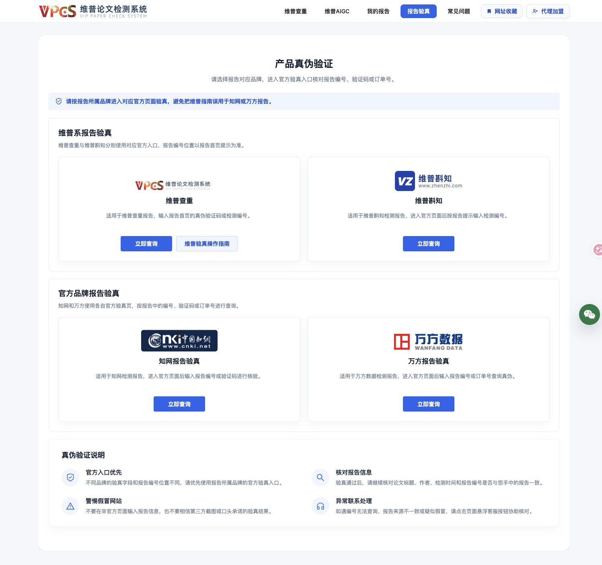
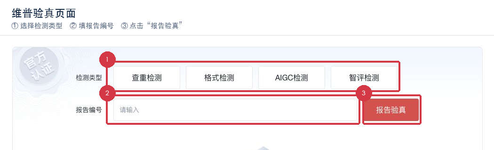
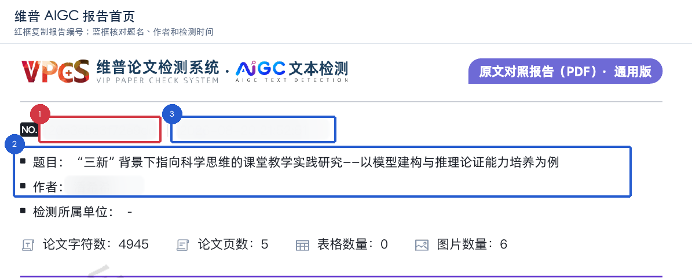
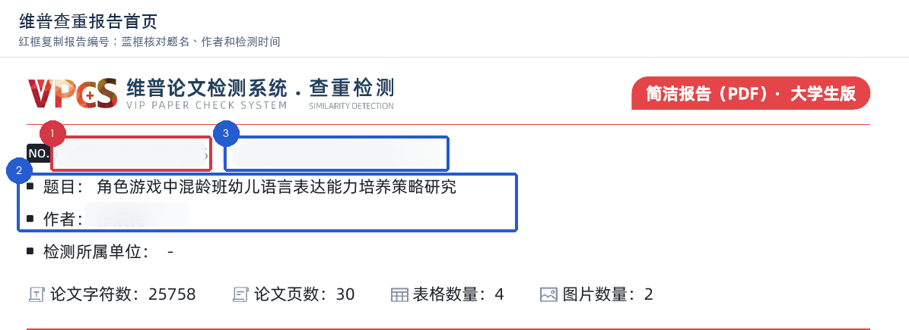
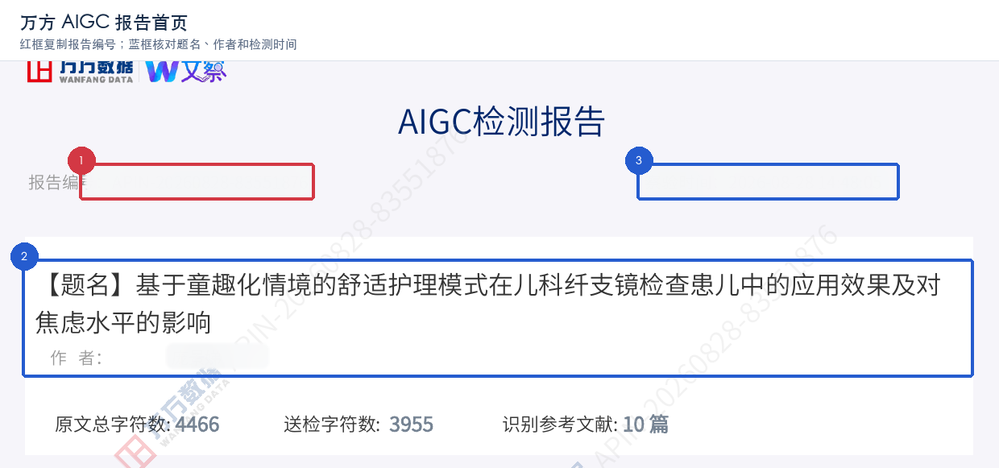
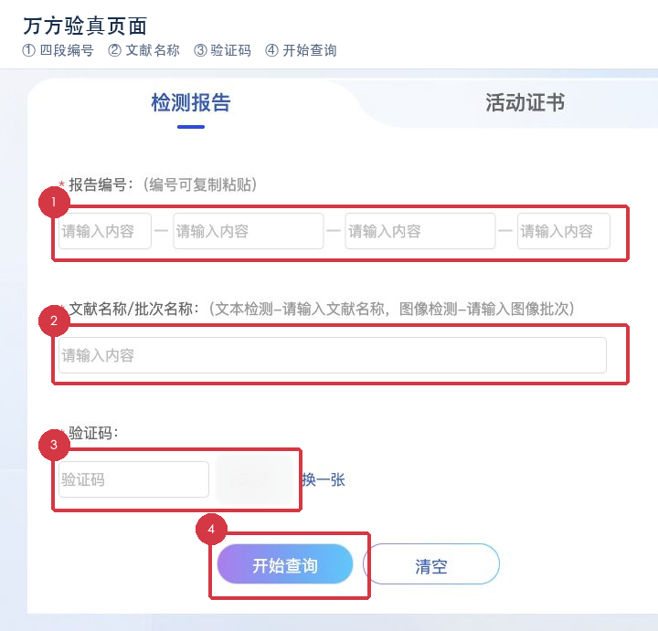
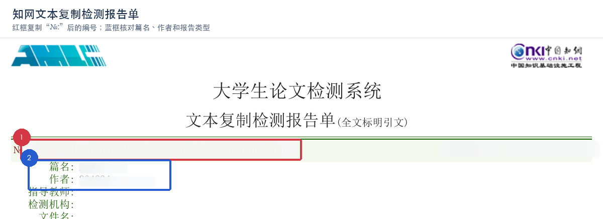
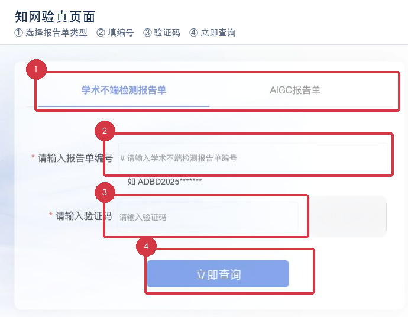

# 论文查重报告验真图文教程

本教程用于“报告是真的吗”“报告验真”“真伪查询”“报告编号在哪里”“验证码怎么填”“查重报告能不能核对”等常见问题。示例图直接截取真实报告首页或实际验真页面；只对报告编号、作者/时间、验证码等敏感值做轻度遮挡，并用红框、蓝框标出用户需要操作或核对的位置。图片中的示例内容仅用于识别版式，不能当成可查询的真实编号。

## 先记住一个入口

打开统一入口：[`https://vpcs.cqccjy.cn/pwp/verify`](https://vpcs.cqccjy.cn/pwp/verify)。

进入后按报告所属品牌选择卡片：维普查重/维普斟知、知网报告验真、万方报告验真。页面会将你带到对应的官方验真表单。不要从报告正文、陌生客服消息或截图里的不明链接跳转。

### 三秒识别报告品牌

| 报告首页常见标识 | 应选品牌/类型 | 首先找什么 |
|---|---|---|
| `VPCS`、维普论文检测系统、查重检测 | 维普 → 查重检测 | 首页顶部的 `NO.` 或 `报告编号` |
| `VPCS`、AIGC 文本检测 | 维普 → AIGC检测 | 首页顶部的 `NO.` 或 `报告编号` |
| 万方数据/文察、AIGC检测报告 | 万方报告验真 | 首页左上 `报告编号` 和 `题名` |
| 中国知网、文本复制检测报告单 | 知网 → 学术不端检测报告单 | 首页 `№:` 后的长编号 |
| 中国知网、AIGC报告单 | 知网 → AIGC报告单 | 首页 `№:` 后的长编号 |

品牌不确定时，不要猜。先让用户提供报告首页顶部的品牌名称和报告类型（可以遮住编号和姓名），再选择入口。

## 维普系报告：先选检测类型，再填报告编号

1. 打开统一入口，进入“维普查重”卡片的“立即查询”。如果报告是 AIGC、格式或智评，按报告页眉选择对应类型；类型选错会导致编号无法识别。
2. 在报告首页找到 `NO.`、`报告编号` 或“真伪验证码/检测编号”提示。只复制编号值，不要复制 `NO.`、`报告编号：` 等字段名，也不要复制页脚、二维码旁的文字。
3. 在“报告编号”框粘贴后点击“报告验真”。不要把题名、作者或重复率填进这个框。
4. 返回结果后，至少核对报告类型、论文题目、作者、检测时间和编号是否与手中原报告一致。只显示“通过”而标题或作者不一致时，不能视为同一份报告。

维普报告中 `NO.` 一般位于首页顶部，查重和 AIGC 报告的版式不同，但位置逻辑相同。报告中的相似率、AIGC 百分比、字符数只用于阅读，不是验真输入字段。

下面两张报告首页截图片分别展示维普 AIGC 报告和维普查重报告的常见版式：红框表示要复制的顶部编号，蓝框表示验真后要核对的基本信息；不能把结果百分比、章节统计或页脚编号当作输入。

## 万方报告：四段编号 + 文献名称 + 验证码

始终先打开统一入口并点击“万方报告验真”。只有统一入口暂时不可访问、且用户需要核对官方页面时，才参考备用页 [`https://truth.wanfangdata.com.cn/`](https://truth.wanfangdata.com.cn/)。

按页面逐项填写：

| 页面字段 | 从报告哪里取 | 填写规则 |
|---|---|---|
| 报告编号 | 首页标题下方的 `报告编号` | 按页面四个输入框分段粘贴；保留字母大小写和必要的连字符，不要把字段名或空格一起粘贴 |
| 文献名称/批次名称 | 报告中的 `题名`；图像检测才使用批次名称 | 尽量逐字复制，中文书名号、破折号、括号和空格按原报告保留；不要用下载文件名代替题名 |
| 验证码 | 页面验证码图片 | 由用户本人现场识读并输入；看不清就点“换一张”，不要让 Skill 猜测或代填 |

万方当前表单有“开始查询”和“清空”按钮。提交后重点比对题名、作者（若结果页展示）、检测类型和时间。万方 AIGC 报告首页的 `报告编号`、`题名` 和 `检测结果` 是三个不同区域，不能把结果百分比当成编号。

### 万方复制小技巧

- PDF 可复制时：放大首页，拖选 `报告编号` 冒号后的值，按 `⌘C`/`Ctrl+C`，在编号框粘贴；如果被拆成多行，先在纯文本编辑器中合并，再按页面分段框填写。
- 文件名与题名不一致时，以报告首页 `题名` 为准；题名过长也不要自行缩写。
- 只拿到截图时，编号应逐字符核对 `0/O`、`1/I`、大小写和连字符；无法确认就索取清晰 PDF，不要连续试错。

## 知网报告：选择报告单类型 + 编号 + 验证码

始终先打开统一入口并点击“知网报告验真”。只有统一入口暂时不可访问、且用户需要核对官方页面时，才参考备用页 [`https://check7.cnki.net/codeverify/`](https://check7.cnki.net/codeverify/)。

1. 报告标题写着“文本复制检测报告单”或学术不端类报告时，选择“学术不端检测报告单”；标题写着 AIGC 报告单时，选择“AIGC报告单”。
2. 从报告首页 `№:` 后复制报告单编号。不要复制 `№:`、检测时间、篇名、作者或页脚页码。
3. 粘贴到“请输入报告单编号”，再由用户本人识读验证码并填入“请输入验证码”，点击“立即查询”。
4. 结果页应能对应报告类型和基本信息；只返回“无记录”或信息不一致时，先检查页签、大小写、空格和字符混淆，再停止重复提交并联系官方支持。

知网报告编号通常很长，复制时最容易把换行、不可见空格或页眉一起带上。推荐先粘贴到纯文本编辑器，删除换行和首尾空格后再提交；不要删除编号内部原本存在的字母或连字符。

## 如何复制：按文件类型处理

### PDF/Word 导出的可选中文本

1. 打开报告首页并放大到能看清字段。
2. 用鼠标从编号值的第一个字符拖到最后一个字符；不要从“报告编号：”“№:”开始选。
3. 使用 `⌘C`/`Ctrl+C` 复制，先粘贴到纯文本编辑器检查是否夹带换行、页眉或空格。
4. 去掉首尾空白和意外换行，再粘贴到官方页面。保留字母大小写、数字和报告本身的连字符。

### HTML 报告或网页截图

优先复制网页文本中的字段值；截图只能作为定位参考。截图里的 OCR 可能把 `0/O`、`1/I`、半角/全角符号识别错，必须逐字人工核对。

### 扫描件或无法复制的图片

不要让第三方 OCR 网站接收整份报告。可以局部放大后手动抄写编号，再用原报告的题名、作者和时间交叉核对。编号仍看不清时，向报告出具方索取清晰原件。

## 验真通过后，还要核对什么

“验真通过”只说明官方系统能找到相应记录，不代表论文内容合格、重复率达标或 AIGC 判断一定正确。至少做以下交叉核对：

- 报告品牌和检测类型是否一致；
- 论文题目、作者或送检主体是否一致；
- 检测时间是否与报告生成时间大致相符；
- 报告编号是否与原报告首页完全一致；
- 报告中的总体指标、章节/片段统计和报告版本是否一致。

## 常见失败与安全边界

| 现象 | 先检查 | 不要做 |
|---|---|---|
| 无记录 | 品牌、检测类型、页签、编号大小写、隐藏空格 | 不要连续创建新订单或在陌生网站反复提交 |
| 信息不一致 | 题名是否用文件名替代、报告类型是否选错 | 不要只看“通过”两个字就判定为真 |
| 验证码看不清 | 点击官方页面的换图/刷新 | 不要让 Skill 猜验证码或绕过验证 |
| 报告只有截图 | 编号是否被裁切、是否能看清 `0/O` 等字符 | 不要把 OCR 结果当成最终编号 |
| 页面要求登录或人工审核 | 按官方页面提示由用户本人处理 | 不要提供账号密码、验证码或报告正文给第三方 |

Skill 不会把报告编号、验证码、订单号写入回答、日志或长期目录，也不会把完整报告上传到非官方页面。验真结果无法自动判断时，明确告诉用户“无法自动判断”，保留原报告并联系对应品牌官方支持。

## 给用户的简短引导模板

> 打开[论文查重报告验真入口](https://vpcs.cqccjy.cn/pwp/verify)，先按报告品牌选择维普、知网或万方。维普填首页 `NO.`/报告编号；万方填分段报告编号、题名和验证码；知网先选报告单类型，再填 `№:` 后编号和验证码。验证码请本人识读，提交后核对题目、作者、时间和编号是否与原报告一致。验真通过不等于论文合格，信息不一致时不要继续试错。

## 相关资料

- [验真合约](contract.md)：固定入口、字段边界和不可自动化事项。
- [页面字段快照](browser-pages.md)：当期页面的可见控件和直达地址。
- `scripts/paper_check_client.py verify`：返回当前环境认可的固定验真入口，不接受用户自定义 URL。
